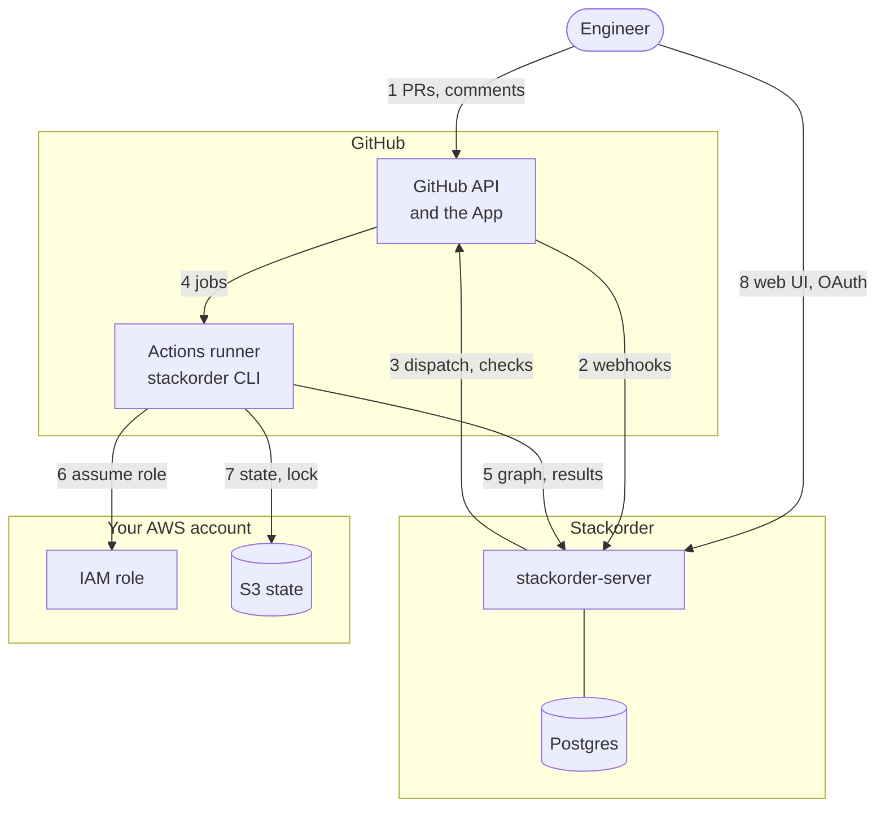
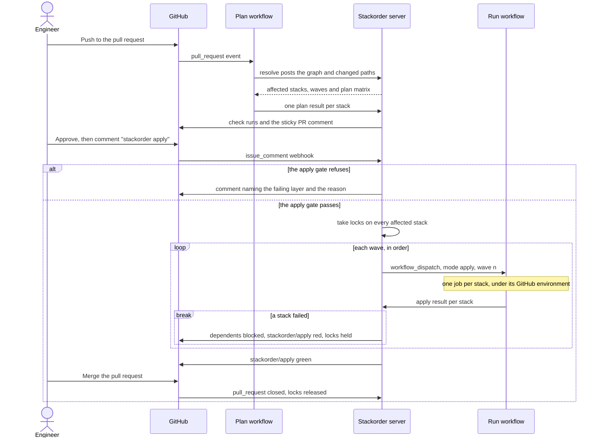
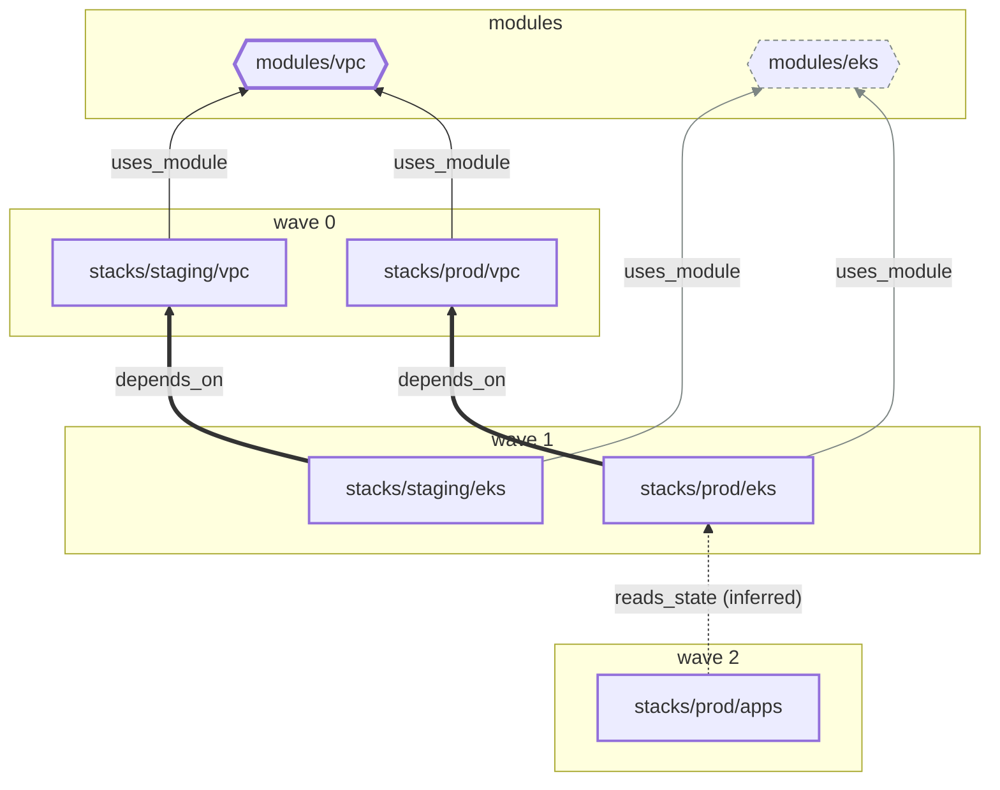
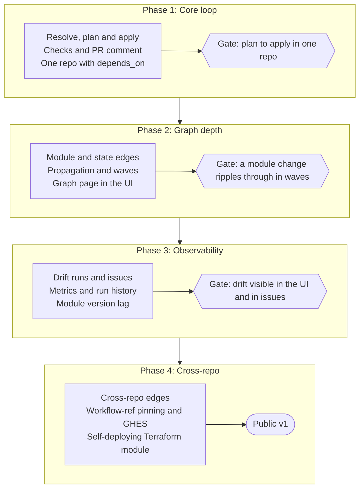

# Stackorder design document

Sep 28, 2026 · @Francis Dortort

::: info Implementation notes
This is the design document, the source of truth for behaviour, reproduced as written. Where the implementation departs from it, a note like this one next to the affected paragraph says how, following the decisions recorded in the [architecture contract](./architecture). The guide, configuration, reference and operations pages describe the code.
:::

## Summary and positioning

Stackorder is a GitHub App plus a small control-plane server that decides *which* Terraform or OpenTofu stacks to run and *in what order*, then lets GitHub Actions do all of the running. Execution, credentials, state and modules stay entirely inside the user's GitHub org and AWS account; the server receives metadata and redacted, size-capped plan text, never cloud credentials or Terraform state.

The server has exactly two jobs:

1. **Dependency resolution**: hold the graph of stacks, shared modules and the edges between them; compute the affected set for a change; order applies into waves; serialize conflicting work with stack-level locks.
2. **Observability**: record every plan and apply per stack and per commit, surface drift, show the dependency graph and "who consumes this module at which version", and expose it all through a small web UI, a JSON API and Prometheus metrics.

It is explicitly **not** a state backend, a module registry, a secrets store, a policy engine or a runner. State lives in the user's S3 bucket (with S3-native or DynamoDB locking), modules live in git, and Terraform runs on GitHub-hosted or self-hosted Actions runners under the user's own OIDC-federated AWS role.

|  | HCP Terraform | Terrakube | Stategraph (formerly Terrateam) | Stackorder |
| --- | --- | --- | --- | --- |
| Where Terraform runs | HashiCorp-hosted VMs by default, or self-hosted agents | Its own executors: a pod pool, Kubernetes Jobs or self-hosted agents | Your GitHub Actions or GitLab CI runners | GitHub Actions |
| State backend | Built in | Built in, on its configured object storage | Bring your own | Bring your own S3 |
| Module registry and tracking | Built-in private registry; the Explorer shows module usage | Built-in private module and provider registry | A module-aware indexer, off by default, plans the directories that use a changed local module | No registry; tracks module consumers from git sources only |
| Runtime footprint | SaaS; self-hosted Terraform Enterprise runs containers with PostgreSQL, object storage and Vault | API, executor, registry, UI, Dex (with OpenLDAP by default), a Redis-compatible store, object storage and Postgres | Server + Postgres behind a public HTTPS URL; Docker container action on the runner | One container + Postgres; non-Docker actions |
| Cross-stack dependencies | Run triggers between workspaces; linked Stacks | Shared remote state in the stable 2.33 line; run triggers only in 2.34 pre-releases | Layered runs within one repository | First-class graph incl. modules and cross-repo edges |
| Cloud credentials held by server | Yes: stored as variables, or short-lived per-run credentials through OIDC | Yes: stored as variables; with dynamic credentials it holds an OIDC signing key and mints tokens | No; they stay on the runner | No |

Competitor facts were last reviewed on 2026-09-30; the [comparison page](/guide/comparison#sources) links their sources.

The one-line pitch: the execution model of Stategraph, where Terraform runs on your own CI runners, with one server container plus Postgres, no Docker on the runner side, and dependencies (stack to stack, stack to module, across repos) as the server's core data structure.

## Design principles and non-goals

Every design choice below follows from five principles.

1. **The server is a coordinator, not an executor.** It holds no cloud credentials, no state, no plan files with secrets. If the server is compromised, the attacker can trigger workflows and post comments; they cannot touch infrastructure. If the server is down, PR plans still run; only applies pause.
2. **GitHub already provides most of the control plane.** Authentication (OIDC), authorization (repo permissions, CODEOWNERS, environments with required reviewers), audit (Actions logs, check runs), secrets and compute all come from GitHub. Stackorder adds only what GitHub cannot: a graph across stacks, modules and repos, and a memory of what ran.
3. **Heavy work happens on the runner.** HCL parsing, git diffing, `terraform plan`, output redaction and artifact upload all run in the Actions job. The server receives a small JSON manifest and returns decisions.
4. **One binary each side.** The server is one Go binary in one distroless image with an embedded web UI. The runner side is one Go CLI (`stackorder`) that the Actions wrap; the same CLI works on a laptop for `stackorder graph` and `stackorder affected`.
5. **Degrade gracefully, never silently.** Any step that cannot reach the server falls back to a local decision and marks the run as `unconfirmed` in the check run, so nobody mistakes a fallback for a green light.

Non-goals, deliberately:

- Terraform state backend or state viewer. Use the S3 backend; Stackorder stores only the S3 key so it can render links.
- Module registry. Modules are referenced by git or local path; Stackorder indexes the references, it does not host the code.
- Policy engine. Run OPA/conftest, Checkov, Infracost or any other tool as a step in the plan job; Stackorder records the step's verdict as a named check on the stack.
- Multi-VCS. GitHub only. The App, OIDC claims and check-run model are GitHub-specific and that is where the leverage comes from.
- Long-lived agents or self-hosted runners managed by Stackorder. Use GitHub's own runner mechanisms.
- Managing the AWS role. The user creates one OIDC-trusted role per environment; Stackorder only tells the workflow which stack is running.

## System overview

Three trust zones, and only the GitHub zone touches all the others. The server exchanges metadata and redacted plan text with GitHub and with runner jobs; it never talks to AWS.



GitHub sends webhooks to the server; the server answers with workflow dispatches, check runs and PR comments. The runner job posts its manifest and results to the server using a GitHub OIDC token, and assumes the user's IAM role using the same OIDC issuer to reach state in S3. Engineers reach the web UI through GitHub OAuth.

What crosses each boundary:

- **GitHub to server**: webhook payloads (HMAC-signed) and, from runners, JSON manifests and result summaries. No repo contents beyond file paths and parsed dependency edges.
- **Server to GitHub**: App installation tokens, scoped to the installation and expiring in an hour, used for `workflow_dispatch`, check runs and comments.
- **Runner to AWS**: the user's role, assumed with `aws-actions/configure-aws-credentials` and a trust policy pinned to the repo and environment. State, lock and plan files never leave this zone.
- **Server to nothing else**: no outbound calls except `api.github.com` and Postgres. This is the property that keeps the Fargate task's security group and IAM role trivial.

::: info Implementation note
The server also fetches GitHub's OIDC signing keys, from `https://token.actions.githubusercontent.com/.well-known/jwks` or `GITHUB_OIDC_JWKS_URL`, and, when they are configured, writes to the artifact bucket and exports traces to `OTEL_EXPORTER_OTLP_ENDPOINT`. See [Server configuration](/reference/server-configuration#network).
:::

## Execution model

Plans are triggered natively by GitHub on every PR push; applies are dispatched by the server one dependency wave at a time. That split is what lets the server stay small and lets plans keep working when it is down.



The resolve job posts the repo's dependency graph for the commit; the server answers with the affected stacks and a plan matrix fans out one job per stack. After approval, the server takes stack locks and dispatches `stackorder-run.yml` per wave; a red wave blocks its dependents and stops, a green last wave turns the `stackorder/apply` check green so the PR can merge.

**Two workflow files in the user's repo**, both thin wrappers around Stackorder's reusable workflows:

| File | Trigger | What it does |
| --- | --- | --- |
| `stackorder-plan.yml` | `pull_request` (opened, synchronize, reopened) | Job `resolve` scans and posts the graph, gets the matrix back. Job `plan` runs one stack per matrix entry. `concurrency` cancels superseded runs for the same PR. |
| `stackorder-run.yml` | `workflow_dispatch` only, called by the server | Input `mode` is `resolve`, `apply` or `drift`; inputs `run_id`, `wave`, `stacks` (JSON, each entry carrying its instance and GitHub environment). Never cancel-in-progress. |

::: info Implementation note
`stackorder-run.yml` takes `mode` as `plan`, `apply` or `drift`, never `resolve`, and a fifth input, `sha`, the commit each job checks out; `stacks` is required. The server always sends all five inputs, and matches the workflow runs it dispatched by the title the wrapper sets with `run-name: stackorder ${{ inputs.mode }} ${{ inputs.run_id }} wave ${{ inputs.wave }}`. See [Workflows](/configuration/workflows#run).
:::

**Plan step, per stack.** `stackorder plan --stack <dir>` runs `init` against the S3 backend, `plan -out`, `show -json`, builds a summary (adds, changes, destroys, replaced addresses), redacts, posts the summary and a size-capped plan text to the server, and uploads the binary plan file as a workflow artifact named `stackorder-plan-<stack>-<sha>`. The server creates one check run per stack (`stackorder/plan: stacks/prod/vpc`) plus a roll-up (`stackorder/plan`), and maintains one sticky PR comment with a collapsible section per stack.

::: info Implementation note
The CLI writes the plan file and its JSON under `STACKORDER_PLAN_DIR`; the `plan` action uploads the artifact. The artifact name replaces `/` and `:` in the stack key with `-`: `stackorder-plan-<key with / and : replaced by ->-<sha>`, holding `<artifact name>.tfplan`.
:::

**Apply gate.** On a `stackorder apply [stack…]` comment (or on merge, in `on_merge` mode) the server verifies, in order: the commenter is allowed to apply every affected stack (see Apply authorization below); the PR has the configured approvals and is mergeable; every affected stack has a plan for the current head SHA; every named policy check on those stacks is green; no affected stack is locked by another PR. Any failure is a comment with the exact reason, not a silent no-op. The server-side checks are the fast, friendly layer; the hard stops are the GitHub environment gate and the IAM trust policy described in that section.

::: info Implementation note
Every layer is evaluated and all failures are reported together in one comment. Approvals count only on the head commit and from users with push permission; a `dirty` merge state refuses and `blocked` does not; with `apply.from_plan` every stack needs a plan artifact; a pull request has at most one apply in flight. Named checks also accept `warn`, which passes. In `on_merge` repositories `stackorder apply` comments are refused, and the merge applies the merge commit with the head commit's plans, checking layers 1 (for the person who merged), 3, 4 and 5. See [How it works](/guide/how-it-works#apply-gate).
:::

**Waves.** Waves are the longest-path layering of the affected subgraph over `depends_on` edges. Wave n is dispatched only after wave n-1 has fully finished; within a wave the matrix runs with `fail-fast: false` so unrelated stacks complete. A failed stack marks every transitive dependent `blocked`, and the run ends after the current wave. `apply.from_plan: true` (default) applies the saved plan file; if the artifact has expired the CLI re-plans and refuses to apply unless the new plan's resource-address set matches the recorded one.

::: info Implementation note
Waves are layered over `depends_on` and `reads_state` edges, as step 4 of the resolution says. The server dispatches once per wave and environment, and splits a dispatch into chunks of at most `apply.max_parallel` stacks; the caller's `max-parallel` input limits the jobs of one dispatch.
:::

**Locks.** A stack lock is an orchestration lock in Postgres, distinct from the S3 state lock. It is taken when an apply is dispatched and released when the PR merges or the apply run in `on_merge` mode completes. A PR closed without merging after an apply keeps its locks and gets a warning comment, because main no longer matches what is deployed; `stackorder unlock` (write permission required) releases them explicitly. Plans on a locked stack still run, with a warning on the check.

::: info Implementation note
Locks are taken on every affected stack before wave 0 is dispatched, and released on merge (`before_merge`) or when the run completes (`on_merge` and manual runs). A closed pull request that still holds locks older than a day gets a reminder every day at 08:00 UTC. A `stackorder unlock` comment needs push permission and releases that pull request's locks; the CLI's `stackorder unlock` needs an API key; `--force-state` only annotates the release.
:::

**Drift.** The server's scheduler dispatches `mode: drift` per stack on `drift.schedule`, staggered across the hour. The CLI runs `plan -detailed-exitcode` on the default branch; exit code 2 marks the stack drifted, records the summary, and optionally opens or updates a single GitHub issue per stack.

::: info Implementation note
Drift checks are dispatched under the environment `default`, never the stack's own, with `sha` set to the default branch head, and assume the plan role (`aws-plan-role-arn`). Drift issues are titled `Drift detected in <key>`, labelled `stackorder-drift`, and closed with a comment when a later check finds no drift.
:::

**Failure handling.**

| Failure | Behaviour |
| --- | --- |
| Plan fails on one stack | Other stacks continue; roll-up check red; apply refused until fixed |
| Apply fails in wave n | Unrelated stacks in wave n finish; dependents blocked; run failed; locks held |
| Server unreachable during plan | CLI computes the affected set locally, plans, sets a neutral `unconfirmed` check with `GITHUB_TOKEN`; apply refused |
| Server unreachable during apply | CLI cannot confirm the lock and refuses to apply (fail closed) |
| Webhook lost | Server polls `workflow_run` state for in-flight runs every 60 s; the CLI's result call is the source of truth |
| Runner dies mid-apply | Stack marked `unknown`; S3 lock left as is; human `stackorder unlock --force-state` required |
| Head SHA changes after plan | Plans invalidated, `stackorder apply` refuses, new push re-plans |

::: info Implementation note
The reconciliation runs every minute: it resends dispatches GitHub never accepted, binds workflow runs to dispatches by the title the wrapper's `run-name` sets, marks the stacks of a dispatch no workflow run picked up within 30 minutes `unknown`, and closes dispatches whose workflow run completed without every stack reporting. A 5xx answer counts as an unreachable server once three retries have failed.
:::

## Dependency model

The graph has two node kinds (stacks and modules) and three edge kinds; the server computes the affected set and apply order from it, and the runner computes the graph itself.



A PR that edits `modules/vpc` affects both VPC stacks through their module edges, then their dependents through `depends_on`, then `prod/apps` through an inferred remote-state edge. `modules/eks` and its edges are recorded but untouched. Waves are the longest path from the roots of the affected subgraph.

**Nodes**

| Kind | Identity | Discovered by |
| --- | --- | --- |
| Stack | `owner/repo//path` plus optional instance | A directory matching `stacks.discover` that contains a `terraform` block with a `backend "s3"`, or any directory listed explicitly; a directory that declares instances is one stack per instance, keyed `path:instance` |
| Local module | `owner/repo//path` | A `module` block whose `source` is a relative path |
| Git module | `owner/repo//path@ref` | A `module` block with a `git::` or `github.com/` source; `ref` is part of the identity |
| Registry module | `registry:namespace/name/provider@version` | Recorded so the UI can list consumers; can never be "changed by a PR" |

::: info Implementation note
A stack's key across repositories is qualified as `owner/repo//key`. The directories "listed explicitly" are `stacks.include`, and directories under `modules.paths` are never discovered as stacks, though one listed in `stacks.include` still is one. A git module hosted off the GitHub instance Stackorder is installed on (github.com, or the Enterprise Server host) keeps its host, as `gitlab.com/acme/modules//vpc@v1.2.0`, and a private registry's module keeps its registry host. See [Concepts](/guide/concepts#modules).
:::

::: info Implementation note
Instances are declared in `.stackorder.yaml` or derived from var files; see [Stack instances](/configuration/instances) and the [architecture contract](/design/architecture#stack-instances).
:::

**Edges**

| Edge | Direction | Source | Affects order | Propagates change |
| --- | --- | --- | --- | --- |
| `depends_on` | stack to stack | `.stackorder.yaml` in the stack directory; may name a stack in another repo | Yes | Yes |
| `uses_module` | stack or module to module | Parsed from `module` block sources, transitively through nested local modules | No | Yes |
| `reads_state` | stack to stack | Inferred from `terraform_remote_state` data sources whose S3 bucket and key match another stack's backend | Yes (soft) | Yes |

Inferred edges are drawn dashed in the UI and carry `inferred: true`; a stack config can promote one to explicit or suppress it with `ignore_inferred`. No other inference is attempted (no parsing of `aws_ssm_parameter` lookups or the like); the aim is a graph people can predict.

**Resolution, given a graph at SHA and a list of changed paths**

1. Directly changed stacks: any changed path under a stack directory (every instance of that directory), after `ignore` globs (`README.md`, `*.md`, `.terraform.lock.hcl` are ignored by default only if `ignore_lockfile` is set). A file outside every stack directory that a stack names in its `backend_config` or `var_files` affects that stack too, with the reason `watch_path`.
2. Module-affected stacks: for every changed path under a local module directory, every stack with a path to that module over `uses_module` edges. Git-pinned modules never match here: a change to the module repo does not change consumers until they bump `ref`.
3. Propagation: dependents of the set above over `depends_on` and `reads_state`, transitively, when `propagate: dependents` (the default). These stacks are planned so reviewers see the downstream effect; at apply time a propagated stack whose plan is a no-op is recorded as `noop` and skipped.
4. Ordering: topological sort of the affected set over `depends_on` and `reads_state`; edges to unaffected stacks are dropped. Waves are assigned by longest path from a root. A cycle fails the resolve check with the cycle spelled out.
5. Cross-repo: `depends_on` edges to stacks in other repos are stored but cannot order a single-repo run. When an upstream stack applies, the server lists external dependents on the run and, if `propagate.cross_repo: plan` is set, dispatches a plan-only run on each so drift shows up within minutes rather than at the next scheduled drift check.

::: info Implementation note
A changed path belongs only to the deepest enclosing stack directory; paths under `.terraform` are ignored. The default `stacks.ignore` is `["**/*.md", "**/README*"]`, and `.terraform.lock.hcl` is added only with `ignore_lockfile`. Any local module a stack uses propagates, inside `modules.paths` or not: those globs only keep module directories from being discovered as stacks. Git and registry modules never match changed paths. Every edge points from the dependent to what it depends on, so `wave(To) < wave(From)`. Cross-repository plan runs have trigger `push` and run once per upstream run and downstream repository. Watch paths are described under [Change detection](/configuration/instances#change-detection).
:::

**Module version tracking.** A git module edge carries its `ref`. When a module repo that has the App installed pushes a semver tag, the server records the version, and the UI shows every consumer stack with the ref it pins and how far behind it is. Bumping is left to Renovate or Dependabot; Stackorder only makes the lag visible.

**Storage.** Graphs are stored per repo and SHA (`graphs`, `stacks`, `modules`, `edges` with an `inferred` flag and a `meta` JSON column). The resolve job sends a tree hash of the paths it scanned, so a re-run on the same tree is a cache hit and posts nothing. A 300-stack monorepo with 2,000 edges is well under a megabyte per graph.

::: info Implementation note
The resolve job always uploads its graph. When the tree hash, a SHA-256 over the repository's `.tf`, `.tf.json`, `.tfvars`, `.tfvars.json`, `.tfbackend`, `stackorder.yaml` and `.stackorder.yaml` files, equals that of a stored graph of the repository, the server reuses the stored graph, stores nothing new and answers with `cached: true`. See [`POST /v1/runs/{id}/graph`](/reference/api#upload-graph).
:::

## The server

One Go binary, one distroless image of roughly 30 MB, one Postgres database, and nothing else required. It runs comfortably in a 0.25 vCPU / 512 MB Fargate task for an org with a few hundred stacks; a second task can be added for availability without any change, because all coordination goes through Postgres.

**Internal packages**

| Package | Responsibility |
| --- | --- |
| `webhook` | Verifies the `X-Hub-Signature-256` HMAC, deduplicates by delivery id, writes the event to the `events` table, returns 202 in under 50 ms. No business logic here. |
| `worker` | Goroutine pool that claims events and jobs with `SELECT ... FOR UPDATE SKIP LOCKED`; every handler is idempotent so a crashed task's work is simply re-claimed. This replaces SQS. |
| `graph` | Graph store and the resolution algorithm from the previous section: affected set, propagation, waves, cycle detection, cross-repo edges. Pure functions over in-memory structs, fully unit-testable. |
| `runs` | State machine for a run: `pending`, `planning`, `planned`, `applying`, `applied`, `failed`, `unconfirmed`; per-stack sub-states including `blocked` and `noop`. Owns locks. |
| `gh` | GitHub App client: JWT to installation token (cached until 5 minutes before expiry), check runs, sticky comment upsert, `workflow_dispatch`, `workflow_run` reconciliation. Retries with the `Retry-After` header respected. |
| `oidc` | Verifies runner tokens against `https://token.actions.githubusercontent.com/.well-known/jwks` (cached), checks `aud`, `repository`, `sha`, `run_id` and optionally `job_workflow_ref`. |
| `sched` | Cron scheduler for drift and stale-lock reminders; leader elected with a Postgres advisory lock so one task schedules and any task executes. |
| `api` | JSON API for runners (OIDC), humans (session cookie from GitHub OAuth) and automation (admin API keys hashed in Postgres). |
| `ui` | Embedded single-page app (Preact + a graph renderer), served from the same binary with `embed.FS`. No separate frontend deployment. |
| `store` | `pgx` queries and `golang-migrate` migrations, run automatically at start-up with a migration lock. |

::: info Implementation note
The implementation has more packages: `config`, `scan`, `graph`, `report`, `command`, `tf`, `client` and `cli` on the runner side; `store`, `gh`, `oidc`, `principal`, `runs`, `webhook`, `worker`, `sched`, `metrics`, `api`, `ui`, `artifacts` and `server` on the server side. `oidc` never compares the `sha` claim (see the OIDC claims below). `sched` also schedules the reconciliation every minute, the hourly prune and the daily installation sync. Runs can also be `superseded`, and stacks `unconfirmed`, `unknown` or `skipped`. See the [architecture contract](/design/architecture).
:::

**Data model** (Postgres, all timestamps UTC)

| Table | Key columns | Notes |
| --- | --- | --- |
| `installations` | `id`, `account`, `suspended_at` | One per GitHub App installation |
| `repos` | `id`, `installation_id`, `full_name`, `default_branch`, `config` (jsonb) | `config` is the parsed `stackorder.yaml` at the default branch, refreshed on push |
| `graphs` | `id`, `repo_id`, `sha`, `tree_hash`, `created_at` | One row per resolved commit; `tree_hash` enables cache hits |
| `stacks` | `id`, `repo_id`, `path`, `workspace`, `backend_bucket`, `backend_key`, `environment`, `config` (jsonb) | Stable identity across graphs, so history survives commits; `environment` is the GitHub environment the apply job runs under |
| `modules` | `id`, `source_key`, `kind` (`local`, `git`, `registry`) | `source_key` is the normalised identity from the previous section |
| `edges` | `graph_id`, `from_kind`, `from_id`, `to_kind`, `to_id`, `type`, `inferred`, `meta` | `meta` holds the git `ref` for module edges |
| `runs` | `id`, `repo_id`, `sha`, `pr_number`, `trigger`, `mode`, `status`, `requested_by`, `started_at`, `finished_at` | `trigger` is `pull_request`, `comment`, `push`, `schedule`, `rerequest` |
| `run_stacks` | `run_id`, `stack_id`, `wave`, `status`, `adds`, `changes`, `destroys`, `replaces`, `exit_code`, `job_url`, `plan_artifact`, `summary` (jsonb), `plan_text` (text, capped at 256 KB) | One row per stack per run; this is the observability core |
| `locks` | `stack_id`, `run_id`, `pr_number`, `taken_at`, `reason` | Primary key on `stack_id`, so a lock is unique by construction |
| `drift` | `stack_id`, `checked_at`, `drifted`, `summary` (jsonb), `issue_number` | Latest row per stack is what the UI shows; history kept 90 days |
| `module_versions` | `module_id`, `version`, `sha`, `tagged_at` | Populated from tag pushes on module repos |
| `events`, `jobs` | `id`, `kind`, `payload`, `claimed_by`, `attempts`, `run_after` | The queue; rows older than 7 days are pruned |
| `sessions`, `api_keys` |  | Human and automation auth |

::: info Implementation note
The schema stores a stack's backend as one `backend` jsonb column, edges by `from_key` and `to_key` so they can point at other repositories, and a ref-less `base_key` family row per module. It adds `graph_stacks`, `graph_modules`, `checks`, `dispatches`, `oidc_jtis` and `audit`, and the trigger `manual`. With the artifact bucket, Postgres keeps only the first 8 KB of plan text. See [Data model](/reference/data-model).
:::

Plan text beyond 256 KB is truncated with a pointer to the Actions job log. An optional `STACKORDER_ARTIFACT_BUCKET` moves full plan text and JSON into an S3 bucket owned by the server's task role, with lifecycle expiry; this is the only optional AWS dependency and it is for Stackorder's own artifacts, never for Terraform state.

**API surface**

| Method and path | Caller | Purpose |
| --- | --- | --- |
| `POST /webhooks/github` | GitHub | All App events |
| `POST /v1/runs` | Runner (OIDC) | Find or create the run for this repo, SHA and PR; returns `run_id` |
| `POST /v1/runs/{id}/graph` | Runner | Upload the scanned graph and changed paths; returns affected stacks, waves, warnings and the matrix JSON |
| `POST /v1/runs/{id}/stacks/{stack}/result` | Runner | Plan or apply outcome, summary, plan text, artifact name |
| `POST /v1/runs/{id}/stacks/{stack}/checks/{name}` | Runner | Named policy or cost check verdict from any tool the workflow runs |
| `GET /v1/repos/{owner}/{repo}/graph?ref=` | Human, automation | Graph as JSON (nodes, edges, waves) for tooling |
| `GET /v1/stacks/{id}`, `GET /v1/stacks/{id}/runs` | Human, automation | Stack detail and history |
| `GET /v1/runs/{id}` | Human, automation | Run detail with per-stack rows |
| `POST /v1/stacks/{id}/unlock` | Human with write permission | Explicit lock release, audited |
| `GET /healthz`, `GET /readyz`, `GET /metrics` | ALB, Prometheus | Liveness, readiness (DB reachable), metrics |

::: info Implementation note
Stack keys in runner paths are percent-encoded (`{key}`). `GET /v1/runs/{id}` also accepts runner tokens. `POST /v1/unlock` releases a lock by repository and stack key, and the human API has more endpoints: `/v1/me`, `/v1/overview`, `/v1/repos`, the repository runs and stacks, modules, `/v1/runs/{id}/rerun` and `/v1/audit`. See [API](/reference/api).
:::

Metrics worth having from day one: runs by status and trigger, plan and apply duration per stack, drifted stacks gauge, locks held gauge, webhook lag, GitHub API rate-limit remaining. Traces are OpenTelemetry with the run id as a span attribute so a run can be followed from webhook to check run.

::: info Implementation note
The metric names are listed on [Metrics and tracing](/reference/metrics); spans carry `stackorder.run_id`, `stackorder.event`, `stackorder.delivery`, `stackorder.job` and `stackorder.job_id`.
:::

**Web UI pages**: org overview (stacks by status, drifted count, locks held); repo graph with affected-set replay for any run; stack page (last apply, history, drift, consumers of and by, pinned module versions); run page (waves, per-stack results, links to the job log and the PR); module page (versions and consumers). Read-only except unlock and re-run, both of which post back through the API and are audited.

**Container and Fargate deployment**

- Multi-stage `Dockerfile`: build the UI with Node, build the Go binary with `CGO_ENABLED=0` embedding the UI, copy into `gcr.io/distroless/static`. Runs as non-root, read-only root filesystem, port 8080.
- Configuration is entirely environment variables: `STACKORDER_BASE_URL`, `DATABASE_URL`, `GITHUB_APP_ID`, `GITHUB_APP_PRIVATE_KEY`, `GITHUB_WEBHOOK_SECRET`, `GITHUB_OAUTH_CLIENT_ID`, `GITHUB_OAUTH_CLIENT_SECRET`, `STACKORDER_OIDC_AUDIENCE` (defaults to the base URL), `STACKORDER_REQUIRED_WORKFLOW_REF` (optional pin), `STACKORDER_ARTIFACT_BUCKET` (optional). Secrets come from Secrets Manager through ECS `secrets`, never baked into the image.
- AWS footprint: one ECS service (1 to 2 tasks) behind an ALB with an ACM certificate; RDS Postgres (`db.t4g.micro` is enough to start) or Aurora Serverless v2; a task role with no permissions unless the artifact bucket is enabled; a security group allowing only ALB ingress and egress to `api.github.com` and RDS. Stackorder ships a Terraform module for all of this so it can deploy itself.
- Behaviour on scale-out: webhook handling, workers and API are stateless; the scheduler is single-leader by advisory lock; sessions live in Postgres. Nothing on local disk matters.
- Upgrades: migrations run at start-up under a lock; the previous image keeps serving until the new task passes `/readyz`.

::: info Implementation note
The image is built on `gcr.io/distroless/static:nonroot` and declares `HEALTHCHECK CMD ["/stackorder-server", "healthcheck"]`. The server also reads `STACKORDER_LISTEN`, `GITHUB_WEB_URL`, `GITHUB_OIDC_ISSUER`, `GITHUB_OIDC_JWKS_URL`, `STACKORDER_ARTIFACT_PREFIX`, `STACKORDER_SESSION_KEY`, `STACKORDER_METRICS_TOKEN`, the three retention durations, `STACKORDER_WORKERS`, the log settings and `OTEL_EXPORTER_OTLP_ENDPOINT`; without the App variables it starts in setup mode. The Terraform module's task egress is HTTPS to anywhere, through NAT or, with `public_tasks`, from the tasks' public IPs, since security groups cannot name hosts. See [Server configuration](/reference/server-configuration).
:::

## The GitHub App

The App is the server's only identity towards GitHub and the only way GitHub reaches the server. It asks for the minimum permission set that still lets it dispatch workflows, write checks and comment.

**Permissions**

| Permission | Level | Why |
| --- | --- | --- |
| Metadata | Read | Required for any App |
| Contents | Read | Read `stackorder.yaml` at the default branch to decide policy without dispatching a job; read tags on module repos |
| Pull requests | Write | Sticky comment, reaction on `stackorder apply`, reading approvals and mergeability |
| Checks | Write | One check run per stack per phase, plus roll-ups |
| Actions | Write | `workflow_dispatch` for `stackorder-run.yml`; reading `workflow_run` and `workflow_job` state; reading artifact metadata |
| Issues | Write (optional) | Only if drift issues are enabled |
| Members | Read (optional) | Only if `apply.allowed_teams` or code-owner team checks are used |
| Deployments | Read and write (optional) | Only if the App is registered as a custom deployment protection rule (see Apply authorization) |

::: info Implementation note
The manifest `/setup` generates requests the Issues, Members and Deployments permissions too, so turning those features on needs no change to the App; on GitHub Enterprise Server it leaves out Deployments. See [GitHub App](/reference/github-app#permissions).
:::

No `Secrets`, `Administration`, `Environments` or `Workflows` permission: the App cannot change workflow files, secrets, environments or protection rules, which keeps a compromised server from widening its own access. An App also cannot be a required reviewer on an environment, so even the optional Deployments permission never lets the server approve a human gate; it only lets the server answer for its own protection rule.

**Webhook events subscribed**: `installation`, `installation_repositories`, `pull_request`, `pull_request_review`, `issue_comment`, `push`, `check_run` (for `rerequested`), `check_suite`, `workflow_run`, `workflow_job`, and optionally `deployment_protection_rule`. `workflow_job` is what gives the UI live per-job progress and runner queue time; `workflow_run` closes the loop on each wave.

::: info Implementation note
The manifest subscribes to `deployment_protection_rule` by default, except on GitHub Enterprise Server, and does not list `installation` and `installation_repositories`, which GitHub delivers to every App. `workflow_job` finds the stack in the job's name: `plan <key>` and `<mode> wave <n> <key>`, as the reusable workflows name their jobs, or GitHub's default matrix form, `<job> (<stack>, …)`.
:::

**Install flow.** The server serves `GET /setup`, which renders a GitHub App manifest with the right webhook URL, permissions and events and posts it to GitHub's manifest-creation endpoint. GitHub returns the App id, private key, webhook secret and OAuth client id and secret in one exchange; the page prints them once as the environment variables to load into Secrets Manager. The whole setup takes one browser visit and no hand-copying of permission checkboxes. Enterprise Server is the same flow with `GITHUB_API_URL` set.

::: info Implementation note
`/setup` opens only with a one-time setup token the server logs at start-up, so nobody else who reaches a fresh server can create the App. `/setup?org=<organisation>` creates the App in an organisation and `&name=` names it. On Enterprise Server set `GITHUB_WEB_URL` as well as `GITHUB_API_URL`. After a restart with the credentials, the server syncs the App's installations at start-up and daily, so installations made during setup are learned.
:::

**Token handling.** The App's private key signs a 10-minute JWT; the server exchanges it for installation tokens (1 hour) cached per installation. Every call to GitHub uses an installation token scoped to that installation, so a repo in one org can never be touched with another org's token. Human sign-in uses the App's user-authorization flow with `login` and `read:org` scope only; a session is issued only if the user is a member of an org where the App is installed, and the UI shows only that org's repos.

::: info Implementation note
Sign-in asks GitHub for the `read:org` scope only. A session is issued to a user whose own account, or one of whose organisations, has the App installed.
:::

**Comment commands** (posted on the PR by anyone the apply policy allows; see Apply authorization): `stackorder plan [stack…]` re-plans; `stackorder apply [stack…]` applies, optionally a subset (dependency waves are still honoured within the subset); `stackorder unlock [stack…]` releases orchestration locks; `stackorder help` prints the list. The App reacts with an eyes emoji on receipt and a rocket when dispatched, so a dropped command is visible.

::: info Implementation note
Commands are accepted only from users with push permission, whatever the apply policy; the gate then applies `allowed_teams`. `stackorder unlock` releases only the locks of the pull request it is posted on, and `stackorder plan` dispatches `mode: plan` under the environment `default`. The rate limit is counted from the audit log.
:::

**Fork pull requests.** The plan workflow's `pull_request` trigger gives forks a read-only `GITHUB_TOKEN` and no `id-token` permission, so neither the AWS role nor the Stackorder API can be reached from a fork. Default behaviour is to post a single neutral check explaining this and to run nothing; maintainers who want fork plans can switch the workflow to `pull_request_target` with a label gate, which Stackorder documents but does not encourage.

::: info Implementation note
`pull_request_target` plans are not supported: the reusable `plan.yml` skips forks whatever the event, and the server accepts plan results only from `pull_request` tokens. The server posts the neutral check when it receives the fork's `pull_request` webhook.
:::

## The CLI and GitHub Actions

All runner-side logic lives in one static Go binary, `stackorder`, and the Actions are thin wrappers around it: one JavaScript action that installs the binary and four composite actions that call it. Nothing is Docker-based, so a job pays roughly one second of overhead instead of pulling or building a container image, and self-hosted runners without a Docker socket work unchanged.

**Why a binary plus thin actions rather than TypeScript actions with all the logic.** HCL parsing needs `hashicorp/hcl` and `terraform-config-inspect`, which are Go libraries with no faithful JavaScript port. Putting the logic in Go also gives engineers the same tool locally: `stackorder graph`, `stackorder affected --base main`, `stackorder plan --stack stacks/prod/vpc` behave identically on a laptop and in CI.

**The `stackorder` CLI**

| Command | In CI | Locally |
| --- | --- | --- |
| `stackorder resolve` | Scans `stacks.discover` paths and module directories, parses `module` sources and `terraform_remote_state` blocks, diffs base to head, posts the graph, writes the matrix to `GITHUB_OUTPUT` | Prints the affected set and waves for a base ref |
| `stackorder plan --stack` | `init` with the S3 backend, `plan -out`, `show -json`, summary, redaction, result upload, artifact upload | Same, without the upload |
| `stackorder apply --stack` | Downloads the plan artifact, verifies its SHA and lock, `apply`, result upload | Refuses unless `--local` and an API key are given, and still takes the lock through the server |
| `stackorder drift --stack` | `plan -detailed-exitcode`, result upload | Same |
| `stackorder graph`, `stackorder affected` | Used by `resolve` internally | Inspection and debugging; `--format dot` for Graphviz |
| `stackorder unlock` | Not used | Releases an orchestration lock through the API, audited |

::: info Implementation note
The CLI also has `check` and `version`. The `plan` and `apply` actions upload and download the plan artifact; the CLI does neither. `apply` in CI checks the run's SHA against the dispatch's `sha` input and the checkout's `HEAD`. On a laptop, `plan` and `drift` report to the server only when a server, a run id and `STACKORDER_API_KEY` are all set, and `stackorder unlock` needs an API key. See [CLI](/reference/cli).
:::

The CLI detects the tool from `tool: terraform` or `tool: tofu` in the stack config and expects that binary on `PATH`; installing it is left to `hashicorp/setup-terraform` or `opentofu/setup-opentofu` in the workflow, both of which are already JavaScript actions. Provider plugins are cached with `actions/cache` keyed on `.terraform.lock.hcl`.

**Actions in the `stackorder/actions` repository**

| Action | Kind | What it does |
| --- | --- | --- |
| `setup` | JavaScript (`node24`), built with `esbuild` into a single `dist/index.js` | Downloads the pinned `stackorder` release for the runner's OS and architecture, verifies the SHA-256 from the release's checksum file, caches it with `@actions/tool-cache`, adds it to `PATH` |
| `resolve` | Composite | `stackorder resolve` and exposes `matrix`, `waves` and `run-id` outputs |
| `plan` | Composite | `stackorder plan --stack ${{ inputs.stack }}` followed by `actions/upload-artifact` of the plan file |
| `apply` | Composite | `actions/download-artifact` by run id, then `stackorder apply --stack` |
| `drift` | Composite | `stackorder drift --stack` |

::: info Implementation note
`resolve` also outputs `affected`, `count` and `unconfirmed`; the composite actions take `server-url` and `working-directory`, and all but `apply` a `github-token` for the fallback check; `drift` also outputs `exit-code`. See [Actions and reusable workflows](/reference/actions).
:::

The composite actions are each under 30 lines of YAML and contain no logic beyond argument passing, which makes them easy to audit and easy to replace with a direct `run: stackorder …` step for anyone who prefers that.

**Reusable workflows.** The same repository publishes `plan.yml` and `run.yml` as reusable workflows, so a user's own workflow files are a dozen lines each (shown in the repository conventions section). Inputs: `aws-role-arn` (or `aws-role-arn-map`, a JSON map to roles whose keys are a stack path prefix, an exact `path:instance` key or a bare `:instance`, the most specific key winning), `aws-role-session-name` (one name, or one per mode), `tool`, `tool-version`, `stackorder-version`, `runner` (label), `max-parallel`, `working-directory`. In `run.yml` the apply job declares `environment: ${{ matrix.environment }}`, taking each stack's GitHub environment from the dispatched `stacks` JSON, which is what lets environment protection rules gate applies per stack. The job-level `permissions` block in the reusable workflow is the minimum needed:

```yaml
permissions:
  id-token: write      # OIDC to AWS and to the Stackorder server
  contents: read       # checkout
  actions: read        # download the plan artifact from the plan run
  checks: write        # fallback check when the server is unreachable
```

::: info Implementation note
Both reusable workflows require `server-url`. `plan.yml` also takes `aws-region`, `base-ref` and `stacks`, and its `resolve` job needs `pull-requests: read`; the calling job must grant every permission, since a called workflow cannot raise them. `run.yml` also takes `sha` and `aws-plan-role-arn`. Every `run.yml` job, not only applies, runs under `environment: ${{ matrix.environment }}`, which is `default` for plan and drift dispatches, and in the concurrency group `stackorder-stack-<key>`.
:::

Hooks: if `.stackorder/hooks/pre-plan.sh`, `post-plan.sh`, `pre-apply.sh` or `post-apply.sh` exist in the repo, the reusable workflow runs them with `STACKORDER_STACK`, `STACKORDER_STACK_PATH`, `STACKORDER_INSTANCE`, `STACKORDER_RUN_ID` and `STACKORDER_PLAN_JSON` in the environment, plus the stack's configured `env` variables for the mode. This is where OPA, Checkov or Infracost run; each can post a named verdict with `stackorder check --name policy --status pass|fail --summary '…'`, which the server shows as its own check run on the stack and honours in the apply gate.

::: info Implementation note
The CLI runs the hooks itself, in CI and locally, and also sets `STACKORDER_PLAN_FILE`; `STACKORDER_PLAN_JSON` and `STACKORDER_PLAN_FILE` are file paths. `stackorder check` also accepts `--status warn`.
:::

**Authentication to the server with GitHub OIDC.** The CLI requests an ID token from the runner (`ACTIONS_ID_TOKEN_REQUEST_URL`) with `audience` set to the server's base URL and sends it as a bearer token. The server verifies the signature against GitHub's JWKS and then binds the request to the run using the claims:

| Claim | Server check |
| --- | --- |
| `aud` | Equals `STACKORDER_OIDC_AUDIENCE` |
| `repository`, `repository_id` | Repo belongs to an installation the server knows |
| `sha` | Matches the run's SHA (a `pull_request` token carries the head SHA) |
| `run_id`, `run_attempt` | Matches the workflow run the server dispatched, for `stackorder-run.yml`; recorded, for `stackorder-plan.yml` |
| `event_name`, `ref` | Plans come from `pull_request`; applies come from `workflow_dispatch` on the default branch |
| `environment` | For an apply, equals the environment the server assigned to that stack, so a result cannot be posted by a job that ran outside the gate |
| `job_workflow_ref` | If `STACKORDER_REQUIRED_WORKFLOW_REF` is set, must match `stackorder/actions/.github/workflows/*.yml@refs/tags/v1*`, so results can only be posted by the canonical reusable workflow, not by a locally edited copy |
| `actor` | Recorded as `requested_by` on the run |

::: info Implementation note
The `sha` claim is never compared with the run's SHA: GitHub sets it to the merge commit of `refs/pull/<n>/merge` for `pull_request` events and to the default branch head for `workflow_dispatch`, neither of which is the commit being planned. Plan runs are bound by `event_name` `pull_request`, `ref` `refs/pull/<n>/merge` and the pull request's head SHA read from GitHub; dispatched runs by `event_name` `workflow_dispatch`, the default branch `ref`, the dispatch's `run_id` and, for applies, the stack's environment (`default` for plan and drift dispatches). The server also checks `iss`, that `iat` is within 10 minutes, and that the `jti` is new. `STACKORDER_REQUIRED_WORKFLOW_REF` is a glob the operator chooses, validated at start-up. See [OIDC binding](/reference/api#oidc-binding).
:::

There are no shared secrets between the runner and the server. Rotating anything means rotating the App's private key, which the runner never sees.

**Sizing.** A plan job for a typical stack on a GitHub-hosted `ubuntu-latest` runner spends about 5 s on checkout, 2 s on tool setup, 1 s on `stackorder`, and the rest on `init` and `plan`; Stackorder adds under 10 s to whatever Terraform itself needs.

## Apply authorization

Write access to the repo is the floor, not the ceiling: apply is gated by five layers, and only the two that GitHub and AWS enforce are security boundaries. The server-side checks exist for fast, readable refusals; the environment gate and the IAM trust policy are what actually stop an unauthorised apply.

| Layer | Enforced by | What it gates | Availability |
| --- | --- | --- | --- |
| 1. `apply.allowed_teams` | The server | Who may *request* an apply | All plans; needs the App's `Members: Read` |
| 2. Code-owner approval | GitHub (merge) and the server (before-merge apply) | Who must *approve* the change | All plans |
| 3. GitHub Environment with required reviewers | GitHub | Whether the apply *job may start* | Public repos on all plans; private repos need GitHub Enterprise |
| 4. Custom deployment protection rule | GitHub, with the server's logic | Same as 3, decided automatically | Same as 3; extra App permission and event |
| 5. IAM trust policy pinned to the environment | AWS | Whether the job can obtain *credentials* at all | All plans |

**1. Team check on the request.** On `stackorder apply`, the server calls `GET /orgs/{org}/teams/{team}/memberships/{login}` for the commenter and refuses with a comment naming the team unless the membership state is `active`; members of nested child teams count. The rule is per stack, not per repo: a run touching `stacks/prod/**` and `stacks/staging/**` requires the commenter to satisfy every affected stack's `allowed_teams`, or they name a subset. Results are cached for 60 s to stay clear of rate limits. With no `allowed_teams` set, the check falls back to push permission on the repo. This layer fails fast with a good message, and nothing more: a bug or a compromised server skips it.

**2. Code-owner approval as a prerequisite.** `CODEOWNERS` maps `stacks/prod/**` to `@acme/platform-prod`, and branch protection requires review from code owners. In `on_merge` mode that alone is a hard gate, since apply follows merge and GitHub will not merge without the owning team's approval. In `before_merge` mode, `apply.require_codeowner_review: true` makes the apply gate check that at least one `APPROVED` review on the current head SHA comes from a member of the owning team for each affected stack (`GET /repos/{owner}/{repo}/pulls/{n}/reviews`, filtered by `commit_id`), and `apply.four_eyes: true` refuses an apply requested by the PR author. Still a server check, but it reuses GitHub's review audit trail and pairs with the merge rule.

**3. GitHub Environments.** The reusable `run.yml` declares `environment: ${{ matrix.environment }}` on the apply job, and the server assigns each stack an environment from the `environments` map in `stackorder.yaml`, whose keys are a path prefix, `prefix:instance` or `:instance` (overridable per stack and per instance; an instance nothing maps runs under the environment of its own name). Required reviewers on that environment pause the job until a listed user or team member approves in the Actions UI; "prevent self-review" stops the requester approving their own deployment, and a deployment-branch rule limits the environment to the default branch. The server cannot approve, because the App has no Environments permission and an App cannot be a required reviewer, so this gate holds even if the server is fully compromised. Two design consequences: the server dispatches each wave as one run per environment it touches, so a mixed run does not hold staging behind the prod reviewer; and the sticky PR comment links straight to the pending approval so reviewers do not hunt for it. With one dispatch per wave, a three-wave prod apply asks for three approvals; collapsing an apply into a single run with waves as chained jobs is listed under open questions.

::: info Implementation note
A stack that matches no prefix and sets no `environment` of its own runs under the environment `default`, never under an empty name. Plan and drift dispatches always run under `default`. A dispatch carries at most `apply.max_parallel` stacks, so a large wave for one environment is several runs, each gated on its own. See [Workflows](/configuration/workflows#environments).
:::

**4. The App as a custom deployment protection rule.** Instead of a human clicking approve, the App can be registered as a protection rule on the environment. GitHub then sends a `deployment_protection_rule` webhook when the apply job wants to start, and the server approves or rejects through `POST /repos/{owner}/{repo}/actions/runs/{run_id}/deployment_protection_rule` using exactly the checks from layers 1 and 2. That turns the server's policy into something GitHub enforces: the job does not run until the App says yes, and the App only says yes for a request from the right team on a PR with the right approvals. It needs the `Deployments: Read and write` permission and the event subscription marked optional in the App section, and the same plan constraint as layer 3. Layers 3 and 4 can be combined on one environment, in which case every rule must pass.

::: info Implementation note
The server approves plan and drift dispatches as read-only, rejects workflow runs it did not dispatch, re-runs of completed dispatches and environment mismatches, and for applies checks layer 1 and, for applies requested by a comment, layer 2. See [layer 4](/configuration/environments-and-authorization#layer-4).
:::

**5. The AWS trust policy.** None of the above matters if a tampered workflow can assume the apply role directly. The role's trust policy conditions `token.actions.githubusercontent.com:sub` on `repo:acme/infra:environment:production`, a value that appears in the token only when the job actually ran under that environment, and therefore only after its protection rules passed. Adding a `job_workflow_ref` condition pins it further to the canonical reusable workflow at a `v1*` tag (the claim is added to `sub` through the repo's OIDC subject customization endpoint). Now the only path to production credentials runs through the environment gate, whatever the server or the PR's workflow file says.

**Recommended default.** Layer 1 for the error message, layer 3 with a team as required reviewer for the hard stop, and layer 5 to make it airtight. Layer 4 is the upgrade for teams that find the manual approval redundant with code review. The plan role stays open to anyone with write access, since planning is read-only and the plan role has no write permissions.

::: info Implementation note
The plan role must trust `repo:<owner>/<repo>:environment:default` as well as `repo:<owner>/<repo>:pull_request`, because server-dispatched plans and drift checks run under the environment `default`. On a repository with [immutable subjects](/operations/security-hardening#immutable-subjects), `repo:<owner>/<repo>` carries the owner and repository ids. See [Security hardening](/operations/security-hardening#trust-policies).
:::

## Security model

The design goal is that no single compromise reaches infrastructure: the server has no cloud access, the runner has no server secrets, and GitHub's own controls gate the one action that changes anything.

**What each party can do if compromised**

| Compromised | Can | Cannot |
| --- | --- | --- |
| Stackorder server | Dispatch `stackorder-run.yml` in installed repos, post checks and comments, read `stackorder.yaml`, read plan summaries and capped plan text | Read or write Terraform state, assume any AWS role, change workflow files, read repo secrets, approve PRs or environment deployments |
| A PR author with write access | Trigger plans on their PR, comment `stackorder apply` if policy allows | Bypass required approvals, branch protection or GitHub environment reviewers; skip policy checks recorded on the stack |
| A modified workflow in a PR | Change what runs in the plan job on that PR | Post results the server accepts, when `STACKORDER_REQUIRED_WORKFLOW_REF` pins the reusable workflow; assume the AWS role, when the role's trust policy pins `job_workflow_ref` or the environment |
| A leaked App private key | Everything the server can | Everything the server cannot; rotate in the App settings and redeploy |

**Controls that belong to GitHub, not to Stackorder**

- Branch protection requires the `stackorder/plan` and `stackorder/apply` checks and the configured approvals; Stackorder only reports, GitHub enforces the merge.
- GitHub Environments with required reviewers on the apply job add a human gate that the server cannot skip, because the server cannot approve deployments.
- The AWS role trust policy restricts `sub` to `repo:org/repo:environment:prod` or to the `job_workflow_ref` of the canonical reusable workflow, so only that workflow in that repo can obtain credentials.
- Runner OIDC tokens are short-lived and bound to a run; there is nothing to rotate on the runner side.

**Secrets in plan output.** Terraform already masks values marked `sensitive`. The CLI additionally masks anything matching the runner's known secret patterns with `::add-mask::`, truncates plan text at 256 KB, and can be set to `plan_output: summary` per stack so only resource counts and addresses ever reach the server or the PR comment. The full plan lives only in the job log and the plan artifact, both governed by the repo's own access rules and artifact retention.

::: info Implementation note
The CLI does not use a list of the runner's secret patterns. It redacts everything it sends to the server, the step summary or a fallback check with its own rules: private key blocks, JSON web tokens, AWS keys, GitHub and Slack tokens, password and token assignments, and the values of environment variables whose names mark them as secrets. In Actions it registers those values with `::add-mask::` before Terraform runs and passes the job log output through the same redaction. See [CLI](/reference/cli#secrets).
:::

**Data retention.** Plan text is kept 30 days by default, summaries and run history indefinitely, events 7 days, drift history 90 days. All are configurable; nothing in the server is needed to operate Terraform, so wiping the database loses history and locks but never state.

**Availability and failure modes.** The server is not in the path of `terraform plan`, so a server outage degrades to plans with `unconfirmed` checks and refused applies. Postgres is the only stateful dependency; point-in-time recovery on RDS covers it. If GitHub webhooks are delayed, the 60-second `workflow_run` reconciliation catches finished waves. If GitHub Actions itself is down, nothing runs, exactly as with any Actions-based tool.

**Abuse limits.** Comment commands are rate-limited per PR (10 per minute) and ignored from users without write access; webhook deliveries are deduplicated by id; the API refuses OIDC tokens older than 10 minutes and any token whose `run_id` the server has already seen complete.

::: info Implementation note
The API refuses tokens older than 10 minutes and tokens already seen, results for stacks that already finished or for superseded runs, and tokens from workflow runs whose dispatch already completed or is bound to another workflow run.
:::

## Repository conventions

A repo needs three things: a root `stackorder.yaml`, an optional `.stackorder.yaml` in any stack that has dependencies or overrides, and two workflow files. Everything has a default, so the minimum viable `stackorder.yaml` is the `version` line.

**Root `stackorder.yaml`**

```yaml
version: 1

stacks:
  discover: ["stacks/**"]        # dirs with a terraform { backend "s3" {} } block
  exclude: []                    # directory globs that are never stacks
  ignore: ["**/*.md", "**/README*"]
  instances:
    from_var_files: "workspaces/*.tfvars.json"  # one instance per matching file, named by it

modules:
  paths: ["modules/**"]           # local modules whose changes propagate

tool: tofu                        # or terraform; per-stack override allowed
tool_version: "1.9.0"

environments:                     # path prefix, prefix:instance or :instance -> GitHub environment
  "stacks/prod/": production
  "stacks/staging/": staging

env:                              # for the tool and the hooks; a value per mode where it differs
  TF_VAR_environment: "{{ .Instance }}"
  TF_VAR_role: { plan: reader, apply: deployer }

apply:
  mode: before_merge              # or on_merge
  require_approvals: 1
  require_codeowner_review: true  # an APPROVED review from the owning team, on head SHA
  allowed_teams: [platform-eng]   # who may comment `stackorder apply`; default is anyone with write
  four_eyes: true                 # applier must not be the PR author
  from_plan: true
  max_parallel: 6

propagate:
  dependents: true
  cross_repo: plan                # off | plan

drift:
  schedule: "0 6 * * 1-5"
  open_issue: true

plan_output: full                 # or summary
```

::: info Implementation note
Defaults when a key is absent: `tool: terraform`, `apply.mode: before_merge`, `require_approvals: 0`, `max_parallel: 6`, `from_plan: true`, `propagate.dependents: true`, `cross_repo: off`, `plan_output: full`, no drift schedule. `apply.max_parallel` caps the stacks in one dispatch rather than concurrent jobs. `allowed_teams` entries are `slug` or `org/slug`, with or without `@`. `modules.paths` keeps module directories from being discovered as stacks; it does not limit which local modules propagate. `drift.schedule` is evaluated in UTC unless it starts with `CRON_TZ=`. Unknown keys are errors. See [`stackorder.yaml`](/configuration/stackorder-yaml).
:::

**Per-stack `.stackorder.yaml`** (in the stack directory)

```yaml
depends_on:
  - stacks/prod/vpc                       # same repo
  - acme/network-infra//stacks/prod/tgw   # another repo, same installation
instances: [production, staging]          # one stack per instance: <path>:production, <path>:staging
workspace: default                        # the Terraform workspace of each instance; default means none
backend_config:                           # -backend-config for init, after the root list; a file or name=value
  - 'key={{ trimPrefix "stacks/" .Path }}/{{ .Instance }}.tfstate'
var_files: ["workspaces/{{ .Instance }}.tfvars.json"]
tool: terraform                           # override
environment: production                   # override the prefix mapping and the instance-name default
apply:
  allowed_teams: [platform-prod]          # narrower than the root setting
plan_output: summary                      # this stack's plans hold secrets
ignore_inferred: [stacks/legacy/dns]      # suppress a remote_state edge
```

::: info Implementation note
A stack's non-empty `apply.allowed_teams` replaces the root list rather than narrowing it, and is read from the default branch, like `plan_output: summary`.
:::

**`.github/workflows/stackorder-plan.yml`**

```yaml
name: stackorder plan
on:
  pull_request:
    types: [opened, synchronize, reopened]
concurrency:
  group: stackorder-plan-${{ github.event.pull_request.number }}
  cancel-in-progress: true
jobs:
  plan:
    uses: stackorder/actions/.github/workflows/plan.yml@v1
    with:
      aws-role-arn: arn:aws:iam::123456789012:role/stackorder-plan
      tool: tofu
```

**`.github/workflows/stackorder-run.yml`**

```yaml
name: stackorder run
on:
  workflow_dispatch:
    inputs:
      run_id:  { type: string, required: true }
      mode:    { type: string, required: true }   # resolve | apply | drift
      wave:    { type: string, required: false }
      stacks:  { type: string, required: false }  # JSON array; each entry carries its environment
jobs:
  run:
    uses: stackorder/actions/.github/workflows/run.yml@v1
    with:
      run-id: ${{ inputs.run_id }}
      mode: ${{ inputs.mode }}
      wave: ${{ inputs.wave }}
      stacks: ${{ inputs.stacks }}
      aws-role-arn-map: '{"stacks/prod/": "arn:aws:iam::123456789012:role/stackorder-apply-prod", "stacks/staging/": "arn:aws:iam::123456789012:role/stackorder-apply-staging"}'
    # each apply job runs under the GitHub environment from stackorder.yaml,
    # so the environment's protection rules gate it
```

::: info Implementation note
As written, the two files do not run: both reusable workflows require `server-url`, the calling jobs must grant the permissions, and the dispatch wrapper must declare the `sha` input, set `run-name` and pass `aws-plan-role-arn`. The complete files are on [Workflows](/configuration/workflows). `secrets: inherit` passes nothing to a reusable workflow in another organization, so the files do not use it; provider credentials go in the workflows' [`env` secret](/configuration/workflows#env).
:::

Branch protection on the default branch requires the `stackorder/plan` and `stackorder/apply` checks. The plan role needs read access to state and the read-only permissions the providers need to plan; the apply role has the write permissions. Both trust the GitHub OIDC provider with `sub` restricted to the repo and, for apply, the environment.

**S3 backend.** Each stack's `backend "s3"` block is the source of truth for its state location. The CLI reads `bucket`, `key` and `region` from it, both to run `init` and to report them to the server so the UI can link a stack to its state object. With Terraform or OpenTofu 1.10 and later, `use_lockfile = true` gives S3-native locking with no DynamoDB table; older versions keep using `dynamodb_table`. Stackorder never touches either lock; its own orchestration lock sits above them.

## Delivery plan and open questions

Build the single-repo loop first, then deepen the graph, then the observability that makes the server worth hosting, then cross-repo and hardening. Each phase ends with a demonstration, not a feature list.



Phase 1 alone is already a usable Atlantis-style tool; phase 2 adds the module and state edges, propagation and waves that the graph is built for; phase 4 ends with the public v1 and the self-deploying Terraform module.

**Repository layout**

```text
stackorder/stackorder              Go module, one repo for server and CLI
  cmd/stackorder-server/           server main
  cmd/stackorder/                  CLI main
  internal/{webhook,worker,graph,runs,gh,oidc,sched,api,store}/
  internal/scan/                   HCL scanning shared by CLI and tests
  ui/                              Preact app, built into internal/ui/dist and embedded
  migrations/
  deploy/terraform/                ECS Fargate + RDS + ALB module (dogfooded)
  Dockerfile                       multi-stage, distroless/static, non-root
  .goreleaser.yaml                 CLI release: linux/darwin/windows, amd64/arm64, checksums

stackorder/actions                 Actions and reusable workflows, tagged v1, v1.x.y
  setup/                           JavaScript action (node24), dist/index.js committed
  resolve/ plan/ apply/ drift/     composite actions
  .github/workflows/plan.yml       reusable
  .github/workflows/run.yml        reusable

stackorder/example-infra           Demo monorepo used by end-to-end tests
```

End-to-end tests run against a throwaway GitHub org and a LocalStack S3 bucket; unit tests cover the graph package exhaustively since that is where the correctness risk sits.

### Open questions {#open-questions}

- [ ] Register the name. The `stackorder` GitHub org and the domains `stackorder.io` and `stackorder.dev` were all unregistered on 28 Sep 2026; take all three before anything is published.
- [ ] Default apply mode. This doc defaults to `before_merge` because it keeps main deployable; `on_merge` is simpler for teams that already gate merges heavily. Which should new repos get?
- [ ] Postgres versus DynamoDB. DynamoDB would remove RDS from the footprint, but the queue (`SKIP LOCKED`), the graph queries and the lock table are all simpler in Postgres. Staying with Postgres unless the RDS cost is a blocker.
- [ ] Plan artifact home. Workflow artifacts are free and access-controlled by the repo; the optional server-owned bucket gives longer retention and the UI a full plan view. Ship artifacts-only first?
- [ ] Per-stack dispatch. Wave dispatch keeps the Actions tab readable; per-stack dispatch would shorten large runs. Offer as a config flag in phase 2 or wait for demand?
- [ ] One run per apply. With one dispatch per wave, an environment with required reviewers asks for approval once per wave. A single run with waves as chained jobs (a fixed maximum, empty waves skipped) may reduce that to one approval; verify GitHub's reviewer behaviour for sequential jobs in a test repo.
- [ ] Removed stacks. A stack deleted from the repo currently just disappears from the graph; a reverse-wave destroy flow is out of scope for v1 and needs a design of its own.
- [x] Workspaces. Settled: a directory deployed several times is a set of stack instances, path:instance, each with its own state key, var files, environment variables and GitHub environment; an instance selects a Terraform workspace only when its configuration names one.
- [ ] Pre-dispatch shortcut. The server could use the last graph plus the PR's changed files to skip the resolve job on docs-only PRs. Worth the complexity only if runner minutes turn out to matter.
