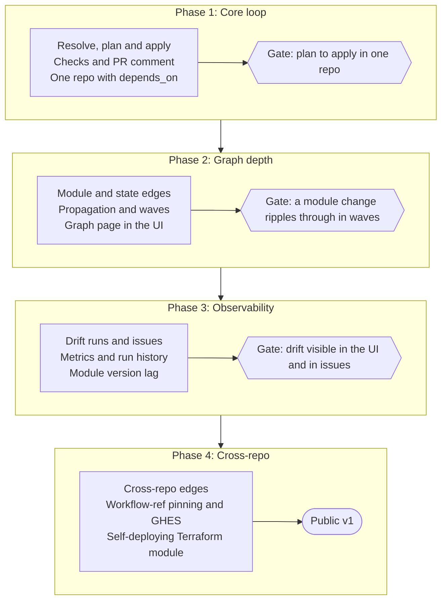

# Roadmap

Build the single-repository loop first, then deepen the graph, then the observability that makes the server worth hosting, then cross-repo support and hardening. Each phase ends with a demonstration, not a feature list. No dates are committed.

## Phases and gates {#phases}

| Phase | Scope | Gate |
| --- | --- | --- |
| 1. Core loop | Resolve, plan and apply; checks and the PR comment; one repository with `depends_on` | Plan to apply in one repository |
| 2. Graph depth | Module and state edges; propagation and waves; the graph page in the UI | A module change ripples through in waves |
| 3. Observability | Drift runs and issues; metrics and run history; module version lag | Drift visible in the UI and in issues |
| 4. Cross-repo | Cross-repo edges; workflow-ref pinning; GitHub Enterprise Server; the self-deploying Terraform module | Public v1 |

Phase 1 alone is already a usable Atlantis-style tool. Phase 2 adds the module and state edges, propagation and waves that the graph is built for. Phase 4 ends with the public v1 and the self-deploying Terraform module.

## How the gates are demonstrated {#testing}

End-to-end tests run the real Terraform and OpenTofu binaries against a LocalStack S3 bucket and the `stackorder/example-infra` demo monorepo, with the server in-process and the CLI as a separate process for every job. GitHub and its Actions token service are in-memory fakes, because a real organization only delivers webhooks to a server it can reach. Teams that run such a server can also run a smaller live variant, which opens a pull request in a throwaway repository of a real organization and waits for the server's resolve and plan checks. Unit tests cover the `graph` package exhaustively, since that is where the correctness risk sits.

| Test level | Build tag | Needs |
| --- | --- | --- |
| Unit | none | Nothing: no Docker, no network, no Postgres |
| Integration | `integration` | Docker, for Postgres; a fake GitHub API |
| End-to-end | `e2e` | Docker, for LocalStack and Postgres; real Terraform or OpenTofu; `example-infra`; optionally a GitHub organization with the App installed |

## Open questions {#open-questions}

The design document keeps the list of [open questions](/design/#open-questions), from the default apply mode to the handling of removed stacks.
