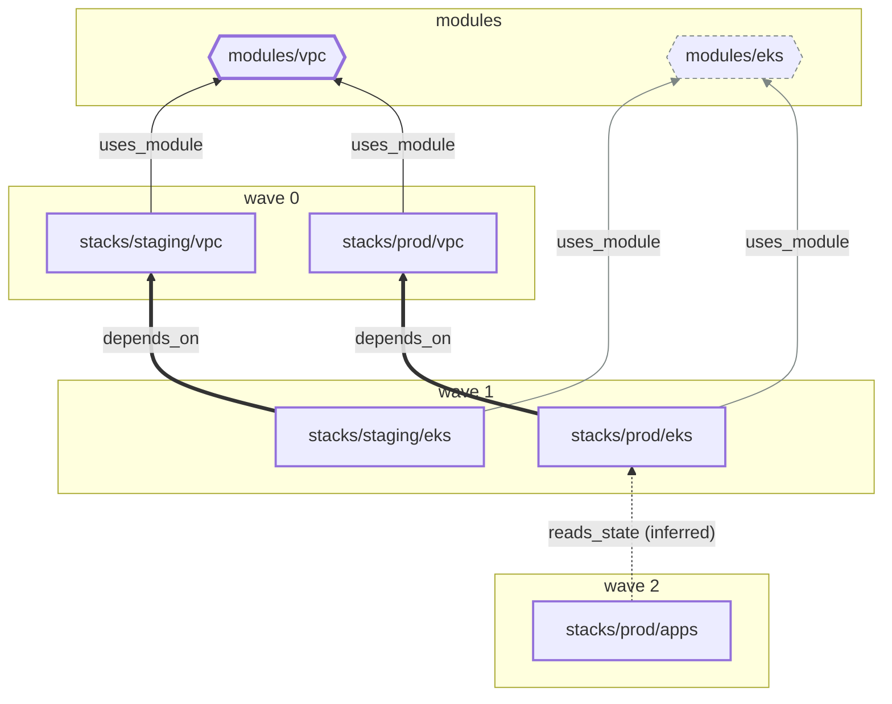

# Concepts

Stackorder works on a dependency graph. The graph has two node kinds, stacks and modules, and three edge kinds. A stack directory deployed several times is several stacks, one per instance. The runner builds the graph; the server stores it and computes the affected set and the apply order from it.

## Stacks {#stacks}

A stack is a directory that Terraform or OpenTofu runs in, with its own state.

- **Discovery.** A directory matching `stacks.discover` (default `stacks/**`) is a stack when it contains a `terraform` block with a `backend "s3"`. Directories listed in `stacks.include` are stacks regardless.
- **Identity.** Inside a repository a stack is identified by its key: the repository-relative path, slash separated, with no `./` and no trailing `/`, followed by `:instance` for an [instance](#instances) of the directory.
- **Environment.** Each stack runs its applies under one GitHub environment, taken from the stack's own `environment` setting or the `environments` map, else its instance name. A stack with no instance that matches nothing runs under the environment named `default`, never under an empty name.
- **Tool.** Each stack runs with `terraform` or `tofu`, set at the root and overridable per stack. The CLI expects that binary on `PATH`.

```text
stacks/prod/vpc                        a stack in this repository
infra/network:production               the production instance of infra/network
acme/network-infra//stacks/prod/tgw    a stack in another repository
```

The server keeps a stable identity per stack across graphs, so a stack's history survives from commit to commit.

## Instances {#instances}

An instance is one deployment of a stack directory: the same code with its own state object, var files, environment variables and GitHub environment. `infra/network:production` and `infra/network:staging` are two instances of `infra/network`.

- **Declaring.** Instances come from a stack's `instances` list, from one var file per instance matched by the root `stacks.instances.from_var_files` glob, or, for a stack that sets a Terraform `workspace`, from that workspace's name.
- **A stack of its own.** Every instance is a separate node in the graph, with its own locks, runs, checks, plan artifacts and drift results. Instances of one directory apply in parallel unless a dependency orders them.
- **Not a workspace.** The suffix names an instance; the instance selects a Terraform workspace only when its `workspace` says so. Most instances differ by the state key their `backend_config` renders.
- **Environment.** An instance applies under the GitHub environment of its own name unless it is mapped elsewhere.

See [Stack instances](/configuration/instances).

## Modules {#modules}

A module is anything a `module` block points at. Its key depends on where the source lives.

| Kind | Key | Discovered by |
| --- | --- | --- |
| Local | `owner/repo//path` | A `module` block whose `source` is a relative path |
| Git | `owner/repo//path@ref`, or `host/owner/repo//path@ref` off the GitHub instance Stackorder is installed on | A `module` block with a `git::` or `github.com/` source; the `ref` is part of the identity |
| Registry | `registry:namespace/name/provider@version` | A registry `module` block; recorded so the UI can list consumers, and never "changed by a PR" |

```text
acme/infra//modules/vpc                      local module
acme/modules//vpc@v1.2.0                     git module on GitHub
gitlab.com/acme/modules//vpc@v1.2.0          git module on another host
registry:terraform-aws-modules/vpc/aws@5.1   registry module
```

Only local modules propagate changes: a changed path under a local module's directory affects every stack that reaches the module over `uses_module` edges, wherever the module lives in the repository. Directories matching `modules.paths` (default `modules/**`) are never discovered as stacks, and appear in the graph as local modules even when no stack uses them yet.

## Edges {#edges}

| Edge | Direction | Source | Affects order | Propagates change |
| --- | --- | --- | --- | --- |
| `depends_on` | stack to stack | `.stackorder.yaml` in the stack directory; may name a stack in another repo | Yes | Yes |
| `uses_module` | stack or module to module | Parsed from `module` block sources, transitively through nested local modules | No | Yes |
| `reads_state` | stack to stack | Inferred from `terraform_remote_state` data sources whose S3 bucket and key match another stack's backend | Yes (soft) | Yes |

A `uses_module` edge carries the pinned git `ref` of the module. A `reads_state` edge carries the matched bucket and key.

### Inferred edges {#inferred-edges}

`reads_state` is the only inferred edge. The UI draws it dashed and the API marks it `inferred: true`. A stack can promote an inferred edge by listing the stack in `depends_on`, or suppress it with `ignore_inferred`.

No other inference is attempted. Stackorder does not parse `aws_ssm_parameter` lookups or similar; the aim is a graph people can predict.

## An example graph {#example-graph}

Two modules and five stacks. Arrows point from a node to what it depends on. The changed module has a thick outline in the accent colour, affected stacks a bold outline, and the untouched module a dashed grey one, with its edges in grey.



A PR that edits `modules/vpc` affects both VPC stacks through their module edges. The change then reaches the EKS stacks through `depends_on`, and `stacks/prod/apps` through its inferred remote-state edge. `modules/eks` and its edges are recorded but untouched. Waves are the longest path from the roots of the affected subgraph, so the VPC stacks apply first and `stacks/prod/apps` last.

The repository page of the web UI draws the same graph and can replay any run on it. Its arrows point the other way, from a dependency to what depends on it, which is the order a change travels and applies run. Replaying the plan of a PR that edits `modules/vpc` colours each affected stack by its status and badges it with its wave, and dims the nodes the change did not reach.

<Screenshot
  name="ui-graph-replay"
  alt="The dependency graph in the web UI replaying a change to modules/vpc: both VPC stacks in wave 0, both EKS stacks in wave 1 and stacks/prod/apps in wave 2, all planned, with modules/eks and a git module dimmed."
  :width="852"
  :height="201"
  caption="The example graph replayed in the web UI, with sample data. Solid arrows are depends_on, the dashed arrow is the inferred reads_state edge, and dotted arrows are uses_module. The sample repository also has a git module that modules/eks uses."
/>

## The affected set {#affected-set}

Given a graph at a commit and the list of changed paths, the server resolves the affected set in five steps.

1. **Directly changed stacks.** Any changed path under a stack directory, after the `stacks.ignore` globs. A path belongs to the deepest stack directory that contains it, so a change inside a nested stack does not affect the stack around it; every instance of that directory is affected. A changed file outside every stack directory that a stack reads, a backend configuration file or a var file, affects that stack as a [watch path](/configuration/instances#change-detection). Paths with a `.terraform` segment are ignored. The defaults ignore `**/*.md` and `**/README*`; `.terraform.lock.hcl` is ignored only when `stacks.ignore_lockfile` is set.
2. **Module-affected stacks.** For every changed path under a local module directory (the deepest one containing it), every stack with a path to that module over `uses_module` edges, through any number of nested modules. Git and registry modules have no directory in the repository and never match here: a change in the module repository does not change consumers until they bump `ref`, which is a change to the consumer itself.
3. **Propagation.** Dependents of the set above over `depends_on` and `reads_state`, transitively, when `propagate.dependents` is true (the default). These stacks are planned so reviewers see the downstream effect. At apply time a propagated stack whose plan is a no-op is recorded as `noop` and skipped.
4. **Ordering.** A topological sort of the affected set over `depends_on` and `reads_state`. Every edge points from the dependent to what it depends on, so for an edge from A to B, B applies first: `wave(B) < wave(A)`. Edges to unaffected or external stacks are dropped. Waves are assigned by longest path from a root. A cycle fails the resolve check with the cycle spelled out, as `a -> b -> a`.
5. **Cross-repo.** `depends_on` edges to stacks in other repositories are stored but cannot order a single-repository run. See [Cross-repo dependencies](/configuration/cross-repo).

Each affected stack carries its reasons, in this order: `changed`, `watch_path`, `module`, `reads_state`, `dependent` and `requested`, and the node keys the change travelled through.

## Waves {#waves}

A wave is a set of stacks that can apply at the same time. Wave 0 holds the stacks with no affected predecessors; wave n holds the stacks whose longest path from a root has length n. The server dispatches one wave at a time and starts wave n+1 only when every stack of wave n has finished and none failed.

A comment that names a subset, such as `stackorder apply stacks/prod/vpc`, still honours dependency waves within the subset. Stacks outside the subset are `skipped`.

## Locks {#locks}

A lock is an orchestration lock on one stack, held in Postgres. It is not the S3 state lock; Stackorder never touches that.

- Taken on all affected stacks before the first wave of an apply is dispatched.
- Released when the PR merges (`before_merge`) or when the run completes (`on_merge` and manual runs).
- Unique by construction: one lock per stack.
- An apply is refused while another PR holds a lock on any affected stack. Plans still run, with a warning.
- Released explicitly with a `stackorder unlock` comment, the UI, the API, or the `stackorder unlock` command with an API key. Every release is audited.

## Drift {#drift}

Drift is a difference between a stack's state and its code on the default branch. The server's scheduler dispatches a drift run per stack on `drift.schedule`; the CLI runs `plan -detailed-exitcode`, and exit code 2 marks the stack drifted. The UI shows the latest result per stack, and the server can keep one GitHub issue open per drifted stack.

## Module version tracking {#module-versions}

A git module edge carries its `ref`. When a module repository that has the App installed pushes a semver tag, the server records the version. The UI then shows every consumer stack with the ref it pins and how many releases it is behind.

Bumping is left to Renovate or Dependabot. Stackorder only makes the lag visible.

## Runs {#runs}

A run is one pass over a set of stacks at one commit: a plan for a PR, an apply, a drift check or a manual run. A run has a trigger (`pull_request`, `comment`, `push`, `schedule`, `rerequest` or `manual`), a mode (`plan`, `apply` or `drift`) and a status. See [Run states](./how-it-works#run-states).

## Identities and names {#identities}

| Thing | Form |
| --- | --- |
| Stack key | `path` or `path:instance` |
| Qualified stack key | `owner/repo//key` |
| Run id | A UUID, used in URLs, workflow inputs and check run output |
| Check runs | `stackorder/resolve`, `stackorder/plan`, `stackorder/plan: <key>`, `stackorder/apply`, `stackorder/apply: <key>`, and `stackorder/<check-name>: <key>` for named checks |
| Sticky PR comment | One per PR, found by the hidden marker `<!-- stackorder:sticky -->` on its first line |
| Plan artifact | `stackorder-plan-<slug>-<sha>`, the slug being the key with `/` and `:` replaced by `-`, then `-` and the first 8 hex characters of the key's SHA-256; the file inside is `<artifact name>.tfplan` |
| Default environment | The instance name for an instance nothing maps; `default` for a stack with no instance that matches no prefix |
