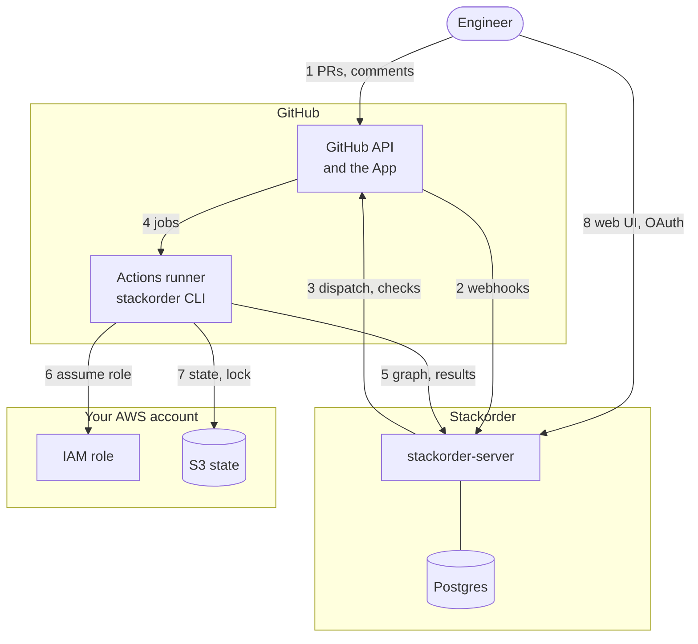
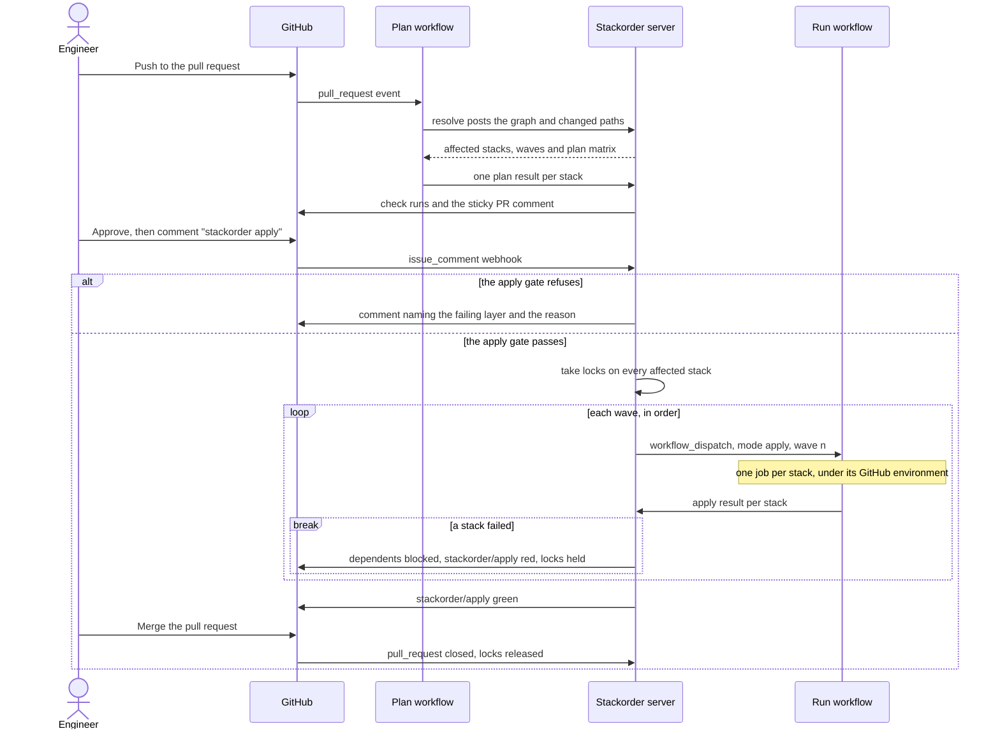
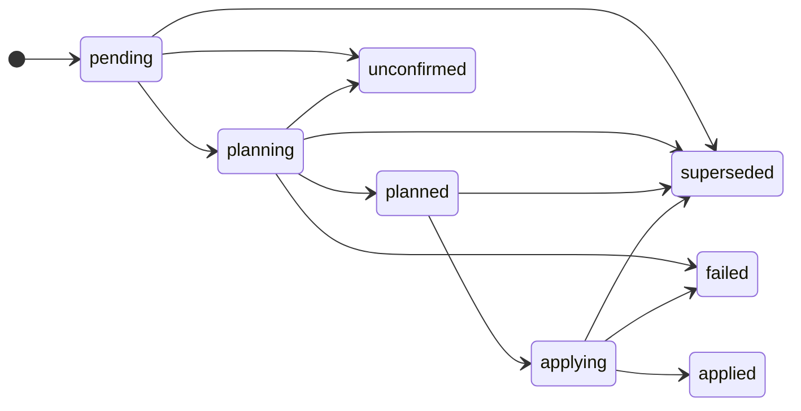

# How it works

GitHub triggers plans natively on every pull request push. The server dispatches applies one dependency wave at a time. That split keeps the server small and keeps plans working when it is down.

## System overview {#system-overview}

There are three trust zones, and only the GitHub zone touches the other two. The server exchanges metadata and redacted plan text with GitHub and with runner jobs. It never talks to AWS on your behalf.

GitHub sends webhooks to the server (2). The server answers with workflow dispatches, check runs and PR comments (3). The runner job posts its manifest and results to the server with a GitHub OIDC token (5), and assumes your IAM role with the same OIDC issuer to reach state in S3 (6, 7). Engineers reach the web UI through GitHub OAuth (8).

What crosses each boundary:

| Boundary | What crosses it |
| --- | --- |
| GitHub to server | Webhook payloads (HMAC-signed) and, from runners, JSON manifests and result summaries. No repository contents beyond file paths and parsed dependency edges. |
| Server to GitHub | Calls made with App installation tokens, scoped to one installation and expiring within an hour: `workflow_dispatch`, check runs and comments. |
| Runner to AWS | Your role, assumed with `aws-actions/configure-aws-credentials` and a trust policy pinned to the repository and environment. State, lock and plan files never leave this zone. |
| Server to anything else | Nothing, except Postgres, GitHub's OIDC signing keys, and, when enabled, an S3 bucket for the server's own plan text and an OTLP endpoint for traces. This keeps the server's network rules and IAM role trivial. |

## Execution model {#execution-model}

Two workflow files live in your repository. Both are thin wrappers around reusable workflows in `stackorder/actions`.

| File | Trigger | What it does |
| --- | --- | --- |
| `stackorder-plan.yml` | `pull_request` (opened, synchronize, reopened) | Job `resolve` scans the repository, posts the graph and gets the matrix back. Job `plan` runs one stack per matrix entry. `concurrency` cancels superseded runs for the same PR. |
| `stackorder-run.yml` | `workflow_dispatch` only, called by the server | Inputs `run_id`, `mode` (`plan`, `apply` or `drift`), `wave`, `sha` (the commit to check out) and `stacks` (JSON array, each entry carrying its GitHub environment). Never cancels in progress. |

The file contents are on the [Workflows](/configuration/workflows) page.

### Resolve

The resolve job runs `stackorder resolve`. It scans the `stacks.discover` paths and module directories, parses `module` sources and `terraform_remote_state` blocks, diffs base to head, and posts the graph with the changed paths. The server answers with the affected stacks, their waves, any warnings and the plan matrix. The job sends a tree hash of the paths it scanned, so a re-run on the same tree is a cache hit.

A dependency cycle fails the `stackorder/resolve` check with the cycle spelled out.

### Plan

For each stack, `stackorder plan --stack <key>`:

1. runs the `pre-plan` hook, then `init` against the stack's S3 backend;
2. runs `plan -out` and `show -json`, then the `post-plan` hook;
3. builds a summary: adds, changes, destroys, replaces and their addresses;
4. redacts the output and posts the summary and a plan text capped at 256 KB to the server.

The `plan` action then uploads the binary plan file as a workflow artifact, named `stackorder-plan-<slug>-<sha>`, where the slug is the key with `/` and `:` replaced by `-`, then `-` and the first 8 hex characters of the key's SHA-256 (`stackorder-plan-stacks-prod-vpc-69df0ef0-<sha>`), so keys such as `a/b` and `a-b` get different artifacts. The server creates one check run per stack, such as `stackorder/plan: stacks/prod/vpc`, plus a roll-up `stackorder/plan`. It keeps one sticky PR comment with a collapsible section per stack.

### Apply gate {#apply-gate}

A `stackorder apply [stack…]` comment starts an apply in `before_merge` mode; a merge starts it in `on_merge` mode. The server checks, in order:

1. The commenter may apply every affected stack: active membership of `apply.allowed_teams` (nested teams count, cached 60 s), or push permission when the list is empty.
2. The PR is open, not merged and mergeable (a `dirty` merge state refuses; `blocked` does not, since `stackorder/apply` is itself a required check), has `apply.require_approvals` approvals on the head commit from users with push permission, and satisfies `four_eyes` and `require_codeowner_review` when set.
3. Every affected stack has a `planned` result for the current head SHA, with a plan artifact when `apply.from_plan` is true.
4. Every named check on those stacks passes. `warn` passes; `fail` refuses.
5. No affected stack is locked by another PR, and no other apply of this PR is in flight.

All failures are collected and reported together in one PR comment naming each failing layer and the exact reason, never a silent no-op. Gate policy is read from `stackorder.yaml` on the default branch, never from the PR's copy. In `on_merge` repositories `stackorder apply` comments are refused; the merge itself starts the apply of the merge commit with the head commit's plans, checking layers 1 (for the person who merged), 3, 4 and 5.

These checks are the fast, friendly layer. The hard stops are the GitHub environment gate and the IAM trust policy. See [Environments and authorization](/configuration/environments-and-authorization).

### Waves {#waves}

Waves are the longest-path layering of the affected stacks over `depends_on` and `reads_state` edges. The server dispatches `stackorder-run.yml` once per wave and environment, so a mixed run does not hold staging behind a production reviewer, and splits a dispatch that would carry more than `apply.max_parallel` stacks.

- Wave n+1 is dispatched only when every stack of wave n has finished and none failed.
- Within a wave the matrix runs with `fail-fast: false`, so unrelated stacks complete.
- A failed stack marks every transitive dependent `blocked`, and the run ends after the current wave.

<Screenshot
  name="ui-run-waves"
  alt="A run page in the web UI for a failed apply of PR #42: wave 0 with both VPC stacks applied, wave 1 with stacks/prod/eks failed and stacks/staging/eks applied, and wave 2 with stacks/prod/apps blocked and not dispatched."
  :width="880"
  :height="710"
  caption="The run page of the web UI, with sample data: stacks/prod/eks failed in wave 1, so stacks/prod/apps is blocked and wave 2 was never dispatched. The PR keeps its locks."
/>

With `apply.from_plan: true`, the default, the apply job applies the saved plan file. If the artifact has expired, the CLI re-plans and refuses to apply unless the new plan's resource-address set matches the recorded one.

### Locks {#locks}

A stack lock is an orchestration lock in Postgres, separate from the S3 state lock. The server takes locks on all affected stacks before it dispatches wave 0. It releases them when the PR merges (`before_merge`) or when the run completes (`on_merge` and manual runs).

Plans on a locked stack still run, with a warning on the check. A PR closed without merging after an apply keeps its locks and gets a warning comment, because the default branch no longer matches what is deployed, and a daily reminder at 08:00 UTC while its locks are more than a day old. A `stackorder unlock` comment (push permission required), the UI, or `stackorder unlock` with an API key releases them.

### Drift

On `drift.schedule`, the server dispatches `mode: drift` per stack, staggered across the hour, at the head of the default branch, under the environment `default` and with the plan role. The CLI runs `plan -detailed-exitcode`. Exit code 2 marks the stack drifted and records the summary; the server can open or update one GitHub issue per stack. See [Drift detection](/configuration/drift).

## Pull request lifecycle {#pr-lifecycle}

This is `before_merge` mode, the default. Applies happen on the PR, and the PR merges once every wave is green. The plan workflow is `stackorder-plan.yml`; the run workflow is `stackorder-run.yml`.

The resolve job posts the repository's graph for the commit. The server answers with the affected stacks, and the plan matrix fans out one job per stack. After approval, the server takes stack locks and dispatches `stackorder-run.yml` per wave. A red wave blocks its dependents and stops the run. A green last wave turns the `stackorder/apply` check green, so the PR can merge.

In `on_merge` mode the gate runs when the PR merges, and the waves apply the merged commit. Branch protection and required reviews then gate the merge itself.

## Run states {#run-states}

A run moves through these states. `superseded` is reachable from any non-terminal state when a new head SHA arrives for the same PR.

Each stack in a run has its own status:

| Stack status | Meaning |
| --- | --- |
| `pending`, `planning`, `planned`, `applying`, `applied` | The normal path. |
| `failed` | The plan or apply failed. |
| `blocked` | A transitive `depends_on` or `reads_state` predecessor failed. |
| `noop` | A propagated stack whose plan is empty at apply time; it is skipped. |
| `unconfirmed` | The CLI reported without a confirmed round trip to the server. |
| `unknown` | The job vanished, for example because the runner died mid-apply. |
| `skipped` | The requester named a subset that excludes the stack. |

A run is `planned` when every stack is `planned`, `noop` or `skipped`, and `applied` when every stack is `applied`, `noop` or `skipped`. It is `failed` when any stack is `failed` or `blocked` and no stack is still running.

## Failure handling {#failure-handling}

| Failure | Behaviour |
| --- | --- |
| Plan fails on one stack | Other stacks continue; the roll-up check is red; apply is refused until it is fixed. |
| Apply fails in wave n | Unrelated stacks in wave n finish; dependents are blocked; the run fails; locks are held. |
| Server unreachable during plan | The CLI computes the affected set locally, plans, and sets a neutral `unconfirmed` check with `GITHUB_TOKEN`; apply is refused. |
| Server unreachable during apply | The CLI cannot confirm the lock and refuses to apply (fail closed). |
| Webhook lost | Every minute the server reconciles open dispatches with GitHub: it resends dispatches GitHub never accepted, binds workflow runs by their title, and marks stacks `unknown` whose dispatch no workflow run picked up within 30 minutes or whose workflow run ended without reporting. The CLI's result call is the source of truth. |
| Runner dies mid-apply | The stack is marked `unknown`; the S3 lock is left as is; a human runs `stackorder unlock --force-state`. |
| Head SHA changes after plan | Plans are invalidated, `stackorder apply` refuses, and the new push re-plans. |

[Troubleshooting](/operations/troubleshooting) turns each row into symptoms and fixes.
