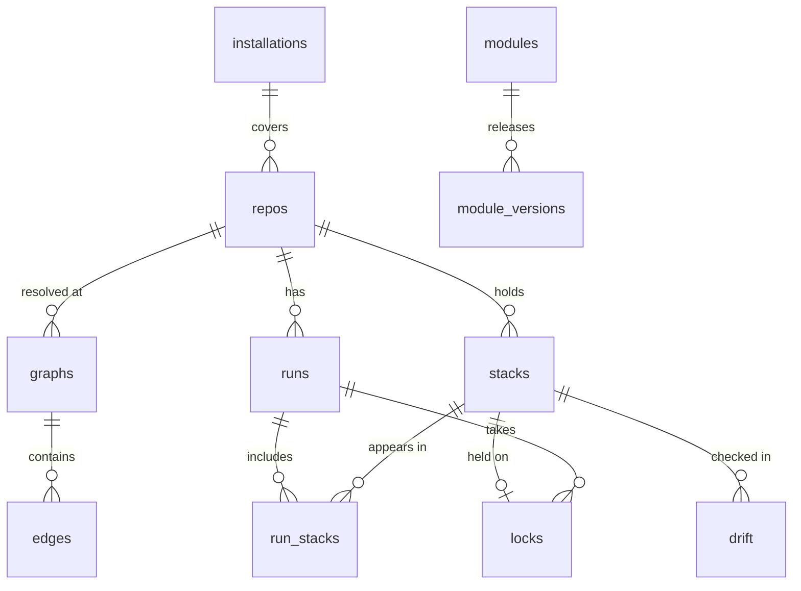

# Data model

Postgres is the server's only stateful dependency. It holds the graphs, the run history, the locks and the work queue. Nothing in it is needed to operate Terraform: wiping the database loses history and locks, never state.

All timestamps are UTC `timestamptz`. Stackorder's own ids (`runs.id`, `stacks.id`, `modules.id`) are UUIDs; `installations.id` and `repos.id` are GitHub's numeric ids.

## Tables {#tables}

| Table | Key columns | Notes |
| --- | --- | --- |
| `installations` | `id`, `account`, `suspended_at` | One per GitHub App installation |
| `repos` | `id`, `installation_id`, `full_name`, `default_branch`, `config` (jsonb) | `config` is the parsed `stackorder.yaml` at the default branch, refreshed on push |
| `graphs` | `id`, `repo_id`, `sha`, `tree_hash`, `created_at` | One row per resolved commit; `tree_hash` enables cache hits |
| `stacks` | `id`, `repo_id`, `path`, `workspace`, `backend_bucket`, `backend_key`, `environment`, `config` (jsonb) | Stable identity across graphs, so history survives commits; `environment` is the GitHub environment the apply job runs under |
| `modules` | `id`, `source_key`, `kind` (`local`, `git`, `registry`) | `source_key` is the normalised module identity |
| `edges` | `graph_id`, `from_kind`, `from_id`, `to_kind`, `to_id`, `type`, `inferred`, `meta` | `meta` holds the git `ref` for module edges |
| `runs` | `id`, `repo_id`, `sha`, `pr_number`, `trigger`, `mode`, `status`, `requested_by`, `started_at`, `finished_at` | `trigger` is `pull_request`, `comment`, `push`, `schedule`, `rerequest` or `manual` |
| `run_stacks` | `run_id`, `stack_id`, `wave`, `status`, `adds`, `changes`, `destroys`, `replaces`, `exit_code`, `job_url`, `plan_artifact`, `summary` (jsonb), `plan_text` (text, capped at 256 KB) | One row per stack per run; the observability core |
| `locks` | `stack_id`, `run_id`, `pr_number`, `taken_at`, `reason` | Primary key on `stack_id`, so a lock is unique by construction |
| `drift` | `stack_id`, `checked_at`, `drifted`, `summary` (jsonb), `issue_number` | The latest row per stack is what the UI shows |
| `module_versions` | `module_id`, `version`, `sha`, `tagged_at` | Populated from tag pushes on module repos |
| `events`, `jobs` | `id`, `kind`, `payload`, `claimed_by`, `attempts`, `run_after` | The work queue |
| `sessions`, `api_keys` | | Human and automation auth; API keys are stored hashed |

Edges point at stacks or modules by kind and id, so they are not drawn as foreign keys above.

## The queue {#queue}

`events` and `jobs` replace a message queue. Webhooks are written to `events` and acknowledged at once. Workers claim rows with `SELECT ... FOR UPDATE SKIP LOCKED`, and every handler is idempotent, so the work of a crashed instance is simply claimed again. `attempts` and `run_after` drive retries.

## Size {#size}

A 300-stack monorepo with 2,000 edges is well under a megabyte per graph. The resolve job sends a tree hash of the paths it scanned, so a re-run on the same tree is a cache hit and posts nothing.

Plan text beyond 256 KB is truncated with a pointer to the Actions job log. With `STACKORDER_ARTIFACT_BUCKET` set, full plan text and JSON go to that S3 bucket instead, with lifecycle expiry.

## Retention {#retention}

| Data | Kept | Setting |
| --- | --- | --- |
| Plan text | 30 days | `STACKORDER_PLAN_TEXT_RETENTION`, default `720h` |
| Queue rows in `events` and `jobs` | 7 days | `STACKORDER_EVENT_RETENTION`, default `168h` |
| Drift history | 90 days | `STACKORDER_DRIFT_RETENTION`, default `2160h` |
| Plan summaries and run history | Indefinitely | |

## Migrations {#migrations}

Migrations are `golang-migrate` SQL files, `NNNN_name.up.sql` and `NNNN_name.down.sql`, embedded in the binary. The server runs them at start-up under a migration lock, so several instances starting together apply each migration once. See [Upgrades and backups](/operations/upgrades-and-backups).
