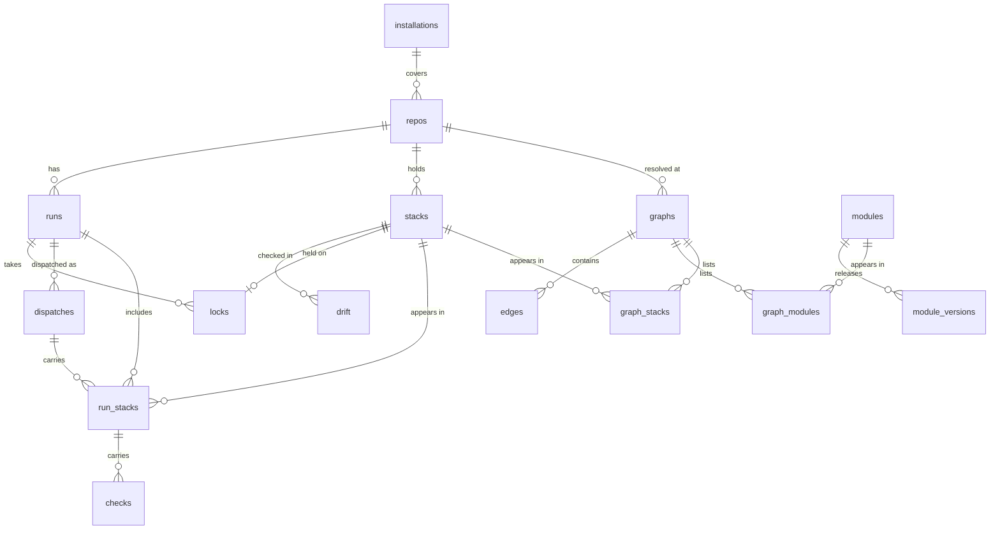

# Data model

Postgres is the server's only stateful dependency. It holds the graphs, the run history, the locks, the audit log and the work queue. Nothing in it is needed to operate Terraform: wiping the database loses history and locks, never state.

All timestamps are UTC `timestamptz`. Stackorder's own ids (`runs.id`, `stacks.id`, `modules.id`, `graphs.id`, `dispatches.id`) are UUIDs; `installations.id` and `repos.id` are GitHub's numeric ids. The schema is created by the migrations in `migrations/`, `0001_graph` to `0007_run_comment`.

## Tables {#tables}

### Graph {#graph-tables}

| Table | Key columns | Notes |
| --- | --- | --- |
| `installations` | `id`, `account`, `account_type`, `suspended_at` | One per GitHub App installation |
| `repos` | `id`, `installation_id`, `full_name` (unique), `default_branch`, `config` (jsonb), `config_sha`, `private`, `default_graph_id` | `config` is the parsed `stackorder.yaml` of the default branch at `config_sha`; `default_graph_id` is the graph of the last merged pull request |
| `graphs` | `id`, `repo_id`, `sha`, `tree_hash`, `warnings`, `external_stacks`, `created_at` | One row per repository and commit (`UNIQUE (repo_id, sha)`); `tree_hash` enables cache hits |
| `stacks` | `id`, `repo_id`, `key`, `path`, `workspace`, `backend` (jsonb), `environment`, `tool`, `config` (jsonb), `first_seen_at`, `last_seen_at`, `removed_at` | Stable identity per repository and key (`UNIQUE (repo_id, key)`), so history survives commits. `key` is `path` or `path:instance`, so each [instance](/configuration/instances) of a directory has its own row, and the instance is split off the key rather than stored in a column; `workspace` is the Terraform workspace the CLI selects, empty for none. `backend` holds the effective S3 bucket, key, region and lock settings, after `backend_config` |
| `graph_stacks` | `graph_id`, `stack_id`, `node` (jsonb) | Which stacks a graph has, with the stack node as scanned, including its `instance` and `watch_paths` |
| `modules` | `id`, `source_key` (unique), `base_key`, `kind` (`local`, `git`, `registry`), `source`, `path`, `ref` | One row per pinned module (`key@ref`) and one ref-less family row per `base_key`, which versions attach to |
| `graph_modules` | `graph_id`, `module_id`, `node` (jsonb) | Which modules a graph has |
| `edges` | `graph_id`, `from_kind`, `from_key`, `to_kind`, `to_key`, `type`, `inferred`, `meta` (jsonb) | Keys rather than ids, so an edge can point at a stack in another repository; `meta` holds `ref` and `source` for module edges, `bucket` and `key` for `reads_state` |
| `module_versions` | `module_id`, `version`, `sha`, `tagged_at` | Semver tags pushed to module repositories |

### Runs {#run-tables}

| Table | Key columns | Notes |
| --- | --- | --- |
| `runs` | `id`, `repo_id`, `sha`, `base_sha`, `pr_number`, `trigger`, `mode`, `status`, `requested_by`, `graph_id`, `waves`, `current_wave`, `warnings`, `workflow_run_id`, `workflow_run_attempt`, `check_runs` (jsonb), `comment_id`, `created_at`, `started_at`, `finished_at` | `trigger` is `pull_request`, `comment`, `push`, `schedule`, `rerequest` or `manual`; `check_runs` records the GitHub check run ids the server created; `comment_id` is the GitHub id of the pull request comment that tracks an apply run, `NULL` until the server looks it up and `0` when the run has no such comment and gets none |
| `run_stacks` | `run_id`, `stack_id`, `wave`, `mode`, `status`, `reasons`, `via`, `environment`, `adds`, `changes`, `destroys`, `replaces`, `has_changes`, `exit_code`, `job_url`, `plan_artifact`, `plan_run_id`, `summary` (jsonb), `plan_text`, `plan_text_truncated`, `plan_url`, `plan_output`, `error_text`, `blocked_by`, `dispatch_id`, `started_at`, `finished_at`, `updated_at` | One row per stack per run; the observability core. `via` lists the modules or stacks the change reached the stack through, as the graph replay shows it. `plan_text` is capped at 256 KB, or 8 KB with the artifact bucket |
| `checks` | `run_id`, `stack_id`, `name`, `status`, `summary`, `details`, `details_url`, `updated_at` | Named check verdicts, one per stack, run and name |
| `dispatches` | `id`, `run_id`, `wave`, `environment`, `mode`, `chunk`, `workflow_run_id`, `dispatched_at`, `sent_at`, `completed_at`, `conclusion` | One row per `workflow_dispatch`, unique per (run, wave, environment, mode, chunk); a workflow run id belongs to at most one dispatch |
| `locks` | `stack_id`, `run_id`, `pr_number`, `taken_at`, `reason` | Primary key on `stack_id`, so a lock is unique by construction |
| `drift` | `id`, `stack_id`, `run_id`, `checked_at`, `drifted`, `summary` (jsonb), `issue_number` | One row per drift check; the latest per stack is what the UI shows |

### Queue and access {#queue-tables}

| Table | Key columns | Notes |
| --- | --- | --- |
| `events` | `id` (the delivery id), `kind`, `payload`, `received_at`, `claimed_by`, `claimed_at`, `attempts`, `run_after`, `done_at`, `last_error` | Webhook deliveries; the delivery id as primary key deduplicates redeliveries |
| `jobs` | `id`, `kind`, `payload`, `dedupe_key` (unique), `run_after`, `claimed_by`, `claimed_at`, `attempts`, `done_at`, `last_error`, `created_at` | Scheduled and internal work |
| `oidc_jtis` | `jti`, `expires_at` | Runner token ids already accepted, so a token is used once |
| `sessions` | `id`, `login`, `user_id`, `avatar_url`, `orgs`, `created_at`, `expires_at` | `id` is the SHA-256 of the session token |
| `api_keys` | `id`, `name`, `key_hash` (unique), `prefix`, `created_by`, `created_at`, `last_used_at`, `revoked_at` | `key_hash` is the SHA-256 of the key, `prefix` its first 10 characters |
| `audit` | `id`, `at`, `actor`, `action`, `target`, `details` (jsonb) | Unlocks, re-runs, manual applies, commands and other audited actions |

`golang-migrate` adds its own `schema_migrations` table.

Edges point at stacks and modules by kind and key, so they are not drawn as foreign keys above.

## The queue {#queue}

`events` and `jobs` replace a message queue. Webhooks are written to `events` and acknowledged at once. Workers claim rows with `SELECT ... FOR UPDATE SKIP LOCKED`, and every handler is idempotent, so the work of a crashed instance is simply claimed again: a claim older than 10 minutes is released, and a handler runs at most 5 minutes. `attempts` and `run_after` drive retries after 1 min, 5 min, 30 min and 2 h; after 5 attempts a row is a dead letter. A job's `dedupe_key` stays taken until the job is pruned, so recurring jobs put a time slot in their key.

## Size {#size}

A 300-stack monorepo with 2,000 edges is well under a megabyte per graph. The resolve job sends a tree hash of the paths it scanned, so a re-run on the same tree is a cache hit and stores nothing new.

Plan text is cut at 256 KB by the CLI. With `STACKORDER_ARTIFACT_BUCKET` set, the full text goes to that bucket and Postgres keeps its first 8 KB; see [Artifact bucket](/reference/server-configuration#artifact-bucket).

## Retention {#retention}

An hourly `prune` job applies the retention settings:

| Data | Kept | Setting |
| --- | --- | --- |
| Plan text in `run_stacks` | 30 days after the row last changed; the summary stays | `STACKORDER_PLAN_TEXT_RETENTION`, default `720h` |
| Webhook events | 7 days after they were received, once done or never claimed | `STACKORDER_EVENT_RETENTION`, default `168h` |
| Finished jobs | 7 days after they finished | `STACKORDER_EVENT_RETENTION` |
| Drift history | 90 days, always keeping the latest result of each stack | `STACKORDER_DRIFT_RETENTION`, default `2160h` |
| Accepted runner token ids | Until the token expires | |
| Sessions | Until they expire, 7 days after sign-in | |
| Locks | Until released | |
| Runs, stack rows, summaries, checks, graphs, API keys, audit log | Indefinitely | |

## Migrations {#migrations}

Migrations are `golang-migrate` SQL files, `NNNN_name.up.sql` and `NNNN_name.down.sql`, embedded in the binary. The server runs them at start-up under a Postgres advisory lock, so several instances starting together apply each migration once, and it refuses to start if a migration fails. See [Upgrades and backups](/operations/upgrades-and-backups).
