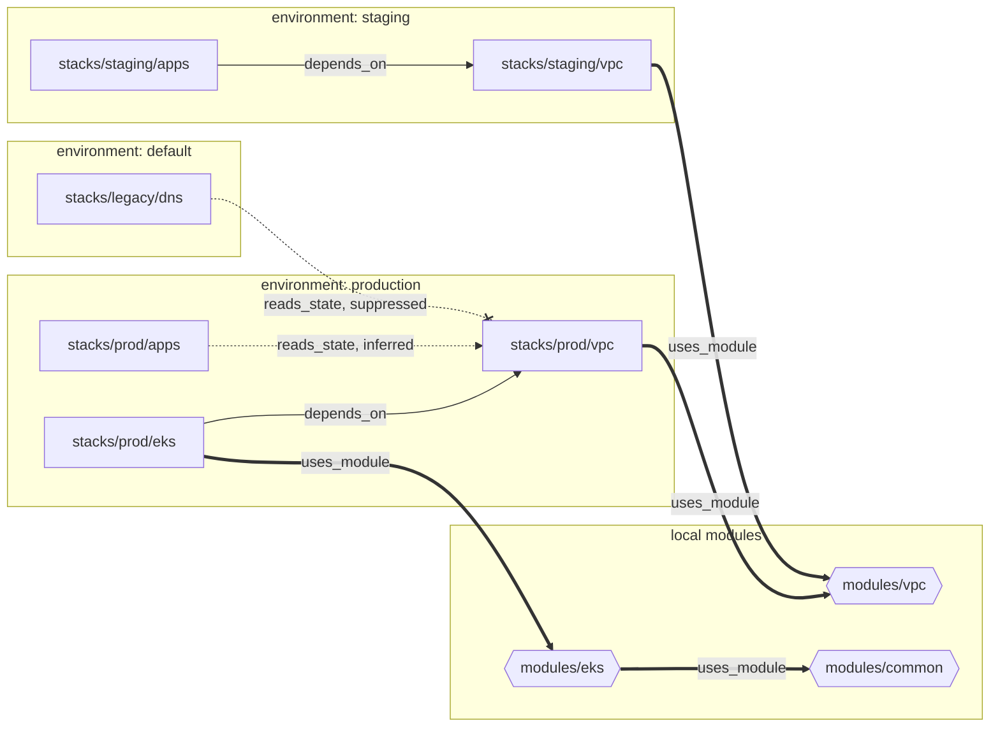

# Stackorder example infrastructure

A small Terraform monorepo wired for [Stackorder](https://github.com/stackorder/stackorder). Its dependency graph has two local modules consumed by stacks, a module that calls another module, explicit `depends_on` edges, an inferred `terraform_remote_state` edge, a suppressed one, and a stack that falls back to the `default` environment.

It serves two purposes. The Stackorder end-to-end tests run the real CLI, server and Terraform against it, and it is the example to read when you want to see how a repository is wired for Stackorder.

Nothing here creates cloud resources. Every resource is a `terraform_data`, and no configuration requires a provider, so `init` downloads nothing and the only network traffic is to the S3 state bucket and to STS, which the S3 backend and `terraform_remote_state` call to validate credentials. VPC, subnet and cluster ids are fake values derived from names, so they are the same on every apply.

## Layout

```text
stackorder.yaml                 repository policy: discovery, environments, apply gate, drift
.github/CODEOWNERS              owning teams per path
.github/workflows/
  stackorder-plan.yml           PR plans through stackorder/actions plan.yml
  stackorder-run.yml            server-dispatched plan, apply and drift through run.yml
  validate.yml                  fmt check, validate and test for Terraform and OpenTofu
.stackorder/hooks/post-plan.sh  example hook: resource count from the plan JSON
modules/
  common/                       tagging helper (locals and outputs only)
  vpc/                          fake VPC and three subnets; tests/ pins the ids the stacks rely on
  eks/                          fake cluster; tags through ../common; tests/ checks tags and inputs
stacks/
  prod/vpc/                     modules/vpc, state prod/vpc.tfstate
  prod/eks/                     modules/eks, depends_on stacks/prod/vpc
  prod/apps/                    reads prod/vpc.tfstate with terraform_remote_state
  staging/vpc/                  modules/vpc, state staging/vpc.tfstate
  staging/apps/                 depends_on stacks/staging/vpc, plan_output: summary
  legacy/dns/                   reads prod/vpc.tfstate, edge suppressed with ignore_inferred
Makefile                        fmt, validate, test, graph
```

Every stack has an S3 backend in bucket `stackorder-example-state`, region `us-east-1`, with `use_lockfile = true` (S3-native locking, which is why stacks require Terraform or OpenTofu 1.10 or later). The state key is the stack path without the `stacks/` prefix, for example `prod/vpc.tfstate`.

## The dependency graph



Arrows point from the dependent to what it depends on, as in the Stackorder API and `stackorder graph` output.

| Arrow | Edge | Declared by | Orders applies | Propagates changes |
| --- | --- | --- | --- | --- |
| Solid | `depends_on` | `depends_on` in the stack's `.stackorder.yaml` | Yes | Yes |
| Thick | `uses_module` | A `module` block with a relative `source`, followed through nested modules | No | Yes |
| Dotted | `reads_state` | Inferred: a `terraform_remote_state` whose S3 bucket and key match another stack's backend | Yes | Yes |
| Dotted, crossed | suppressed `reads_state` | `ignore_inferred` in the reading stack's `.stackorder.yaml` | No | No |

Things worth noticing:

- `stacks/prod/apps` has no `.stackorder.yaml`. Its edge to `stacks/prod/vpc` exists only because its `terraform_remote_state` block names `prod/vpc.tfstate` in `stackorder-example-state`, which is that stack's backend.
- `stacks/prod/eks` takes the VPC id and subnets as variables with defaults, so nothing can be inferred; the order comes from its explicit `depends_on`.
- `stacks/legacy/dns` reads the same state as `stacks/prod/apps`, but lists `stacks/prod/vpc` under `ignore_inferred`, so the edge is dropped and the scan reports a warning saying so.
- `modules/eks` calls `../common`, so a change to `modules/common` reaches `stacks/prod/eks` through two `uses_module` edges.
- `stacks/legacy/` matches no prefix in `environments`, so that stack runs under the GitHub environment `default`.

## What a change affects

Waves are numbered from 0. A wave starts only when the previous one has finished, and the server dispatches `stackorder-run.yml` once per wave and environment. Reasons are the `reasons` values of the resolve response.

### Change `modules/vpc`

| Wave | Stack | Environment | Reason |
| --- | --- | --- | --- |
| 0 | `stacks/prod/vpc` | production | `module`: uses `modules/vpc` |
| 0 | `stacks/staging/vpc` | staging | `module`: uses `modules/vpc` |
| 1 | `stacks/prod/apps` | production | `reads_state`: reads `stacks/prod/vpc` (inferred) |
| 1 | `stacks/prod/eks` | production | `dependent`: depends on `stacks/prod/vpc` |
| 1 | `stacks/staging/apps` | staging | `dependent`: depends on `stacks/staging/vpc` |

`stacks/legacy/dns` is not affected because its edge is suppressed. `modules/eks` and `modules/common` are in the graph but not touched. An apply is four dispatches: wave 0 for production and for staging, then wave 1 for production and for staging.

### Change `stacks/prod/eks` only

| Wave | Stack | Environment | Reason |
| --- | --- | --- | --- |
| 0 | `stacks/prod/eks` | production | `changed` |

Nothing depends on `stacks/prod/eks`. `stacks/prod/vpc` is one of its dependencies, not a dependent, so it is not planned.

### Change `modules/eks`

| Wave | Stack | Environment | Reason |
| --- | --- | --- | --- |
| 0 | `stacks/prod/eks` | production | `module`: uses `modules/eks` |

A change to `modules/common` gives the same result, through `modules/eks`.

### Docs-only change

| Wave | Stack | Environment | Reason |
| --- | --- | --- | --- |
| | none | | |

Editing `README.md`, a stack's `README.md` or any other Markdown file affects nothing. `stackorder.yaml` does not set `stacks.ignore`, so it gets the default `["**/*.md", "**/README*"]`. The plan matrix is empty and no plan job runs.

## How the end-to-end tests use this repository

The e2e suite in `stackorder/stackorder` (`test/e2e`, build tag `e2e`) runs a local server, the `stackorder` CLI and real Terraform against a checkout of this repository, with an S3 emulator standing in for AWS. It creates the bucket `stackorder-example-state` in `us-east-1` before the first `init`.

The backend and the `terraform_remote_state` reads are configured the same way as on AWS; nothing in the HCL points at the emulator. The tests redirect them from the environment:

| Variable | Example value | Used by |
| --- | --- | --- |
| `AWS_ACCESS_KEY_ID`, `AWS_SECRET_ACCESS_KEY` | `test`, `test` | Backend and remote state reads |
| `AWS_REGION` | `us-east-1` | Backend and remote state reads |
| `AWS_ENDPOINT_URL_S3` | `http://s3.localhost.localstack.cloud:4566` | Backend and remote state reads |
| `AWS_ENDPOINT_URL_STS` | `http://localhost:4566` | Remote state reads, which call `sts:GetCallerIdentity` |
| `STACKORDER_BACKEND_CONFIG` | `use_path_style=true,skip_credentials_validation=true,skip_requesting_account_id=true` | Backend only; the CLI passes each item to `init` as `-backend-config` |

Three details matter:

- `STACKORDER_BACKEND_CONFIG` reaches the backend but not the `config` block of a `terraform_remote_state`. The remote state reads therefore validate credentials against STS, so the emulator must serve STS as well as S3 (for LocalStack, `SERVICES=s3,sts`).
- Without `use_path_style`, the remote state reads use virtual-hosted addressing (`http://stackorder-example-state.<endpoint host>/prod/vpc.tfstate`). LocalStack recognises that form under `s3.localhost.localstack.cloud`, whose public DNS resolves to 127.0.0.1. Emulators that take the bucket from the first label of the host, such as moto, also work with `http://localhost:<port>`, wherever `*.localhost` resolves to loopback.
- `stacks/prod/apps` and `stacks/legacy/dns` fail to plan with `Unable to find remote state` until `prod/vpc.tfstate` exists. The tests apply `stacks/prod/vpc` (or upload a state object at that key) before they plan either stack.

## Trying it locally

With no `STACKORDER_SERVER_URL` set, the CLI runs in local mode and needs neither a server nor AWS credentials for `graph` and `affected`:

```sh
git clone https://github.com/stackorder/example-infra.git
cd example-infra

stackorder graph --format dot | dot -Tsvg > graph.svg

git switch -c try-vpc
echo '# touch' >> modules/vpc/main.tf
git commit -am "chore: touch the vpc module"
stackorder affected --base main                 # the first scenario above
```

`make graph` runs `stackorder graph --format dot` when the CLI is on `PATH` and tells you where to get it otherwise.

To check the configuration itself:

```sh
make fmt                # terraform fmt -recursive
make validate           # init -backend=false and validate in every stack and module
make validate TF=tofu   # the same with OpenTofu
make test               # terraform test in every module that has tests
make test TF=tofu       # the same with OpenTofu
```

The module tests use `command = plan` only, so they need no backend and no network. A change under `modules/vpc/tests/` is a change under `modules/vpc`, so a pull request that edits it plans the same stacks as the first scenario above.

## Hooks

The CLI runs `.stackorder/hooks/post-plan.sh` after each plan, in CI and locally, with `STACKORDER_STACK`, `STACKORDER_RUN_ID`, `STACKORDER_PLAN_JSON` and `STACKORDER_PLAN_FILE` set. The example prints one line per stack:

```text
post-plan: stacks/prod/vpc: 4 resources in plan, 0 with changes
```

It needs `jq` and prints a notice instead when `jq` is missing. Replace it with OPA, Checkov or Infracost and report the verdict with `stackorder check`.

## Repository settings the workflows need

`stackorder-plan.yml` and `stackorder-run.yml` call the reusable workflows in `stackorder/actions` at `v1` and read these repository variables (Settings, Secrets and variables, Actions, Variables):

| Variable | Used by | Value |
| --- | --- | --- |
| `STACKORDER_SERVER_URL` | plan, run | Base URL of the Stackorder server, for example `https://stackorder.example.com` |
| `STACKORDER_PLAN_ROLE_ARN` | plan, run | Read-only IAM role for plans and drift checks, trusted for this repository's `pull_request` tokens and for `environment:default` (server-dispatched plan and drift jobs) |
| `STACKORDER_APPLY_ROLE_ARN_PROD` | run | Apply role for `stacks/prod/`, trust policy pinned to environment `production` |
| `STACKORDER_APPLY_ROLE_ARN_STAGING` | run | Apply role for `stacks/staging/`, trust policy pinned to environment `staging` |
| `STACKORDER_APPLY_ROLE_ARN_DEFAULT` | run | Apply role for `stacks/legacy/`, trust policy pinned to environment `default` |

Role ARNs are not secrets, so they are variables. Also set up:

- GitHub environments `production` and `staging`, with required reviewers where your plan allows it. `default` is created on first use, without protection rules.
- Branch protection on `main` requiring the `stackorder/plan` and `stackorder/apply` checks, one approval (matching `apply.require_approvals`) and code-owner review. Applies run before merge here, so add `apply.require_codeowner_review: true` to `stackorder.yaml` if the apply gate should also insist on a code-owner approval.
- The teams named in `.github/CODEOWNERS`: `@stackorder/platform-prod` owns `stacks/prod/**`; `@stackorder/platform-eng` owns `stacks/staging/**` and `modules/**`.

`validate.yml` needs no settings.
